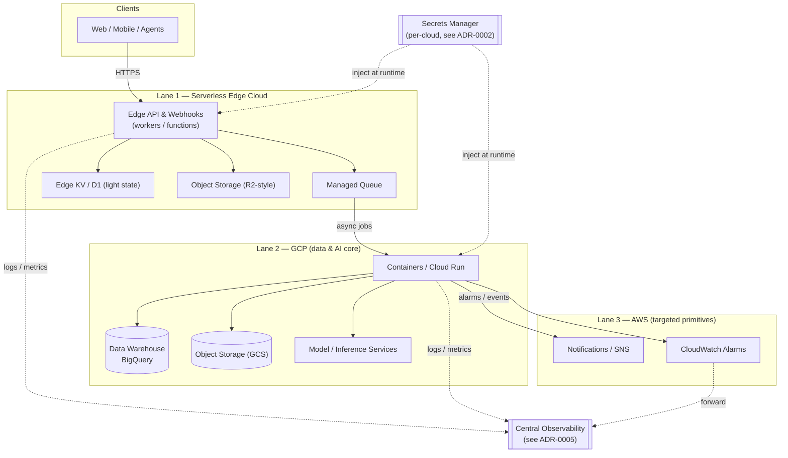

# Multi-Cloud Strategy — GCP, a Serverless Edge Cloud, and AWS

> Cross-cutting architecture · author: **Mark Splawn**

## Problem

The systems in this portfolio span very different workload shapes:

- **Long-running, data-heavy AI/analytics services** that need a managed data warehouse,
  GPU-adjacent inference, and first-class IaC.
- **Globally distributed, latency-sensitive SaaS surfaces** (APIs, webhooks, agent
  endpoints) where cold-start latency and per-request cost dominate.
- **A handful of cloud-specific managed primitives** (a particular alerting/notification
  service, a particular object-storage SLA) that one provider simply does better.

A single cloud forces compromises in at least one of these dimensions, and a naive
"use everything everywhere" approach creates an unmaintainable sprawl of half-learned
services. I needed an explicit, defensible rule for **which cloud owns which workload, and
why** — so the answer is a decision, not an accident.

## Architecture

I design a **deliberate three-lane multi-cloud split**, with each lane chosen for the shape
of the work it carries. The lanes are loosely coupled through a small set of clean contracts
(HTTPS APIs, object storage, and a message queue) so no lane depends on another's internals.

### Lane 1 — Serverless edge cloud (the front door)

The public request surface — REST/JSON APIs, third-party webhooks, agent tool endpoints,
and lightweight orchestration — lives on a **serverless edge platform** (workers/functions
plus the platform's managed queue, KV/SQLite, and object storage). This lane is chosen for:

- **Latency:** code runs close to users with negligible cold start.
- **Cost at low-to-spiky volume:** pay-per-request with a generous free tier; no idle VM bill.
- **Operational simplicity:** no servers, OS patching, or autoscaling groups to manage.

### Lane 2 — GCP (the data and AI core)

Anything that is **stateful, data-gravity-bound, or compute-heavy** runs on **GCP**:
containerized services on Cloud Run, the analytics warehouse (BigQuery), bulk object
storage (GCS), and model/inference workloads. GCP owns this lane because:

- The **managed warehouse + object storage + serverless containers** triad is cohesive and
  well-integrated, which keeps the data pipeline short and the IaC clean.
- **Data gravity:** once large datasets and derived tables live in the warehouse, moving
  compute to the data (not data to the compute) is the cheaper, faster, and safer choice.
- It is the natural home for **Terraform-managed, reproducible infrastructure**
  (see [ADR-0004](../adr/0004-terraform-iac.md)).

### Lane 3 — AWS (targeted, best-of-breed primitives)

AWS is used **surgically**, not as a general-purpose home, for a small set of managed
primitives where it is the strongest option — notifications/SNS and CloudWatch alarms for
specific operational signals. This lane is intentionally **thin**: a few well-understood
services consumed over their APIs, never a second copy of the whole stack.

## Key decisions & trade-offs

| Decision | Why | Trade-off accepted |
|---|---|---|
| **Workload-shape routing**, not a single cloud | Latency, data gravity, and cost curves genuinely differ per workload | More than one console/IAM model to operate |
| **Edge for the front door** | Sub-100ms global latency + pay-per-request economics | Limited heavy-compute and long-running options on the edge |
| **GCP for data + AI** | Warehouse/storage/containers integrate cleanly; data gravity | Egress cost when other lanes read large data — mitigated by keeping compute next to data |
| **AWS kept deliberately thin** | Use its best primitives without owning a full second stack | Cross-cloud calls add a network hop and a second failure domain |
| **Loose coupling via HTTPS + object storage + queue** | Any lane can be swapped without rewriting the others | Slightly more glue code than an all-in-one platform |

### Why not single-cloud?

A single cloud would force one of: edge-grade latency *or* a first-class warehouse *or*
the specific AWS primitives — never all three at their best. The multi-cloud cost (extra
IAM surface, a second failure domain) is real but **bounded**, because lanes 1 and 3 are
deliberately narrow and the contracts between lanes are simple.

### Guardrails against sprawl

Multi-cloud only pays off if it stays disciplined. The rules I design for and apply:

1. **One lane owns each workload class.** No "we'll also run it on the other cloud just in case."
2. **Contracts are boring and portable** — HTTPS, S3/GCS-compatible object storage, and a
   queue. No lane reaches into another lane's database.
3. **A new cloud service must clear a bar:** it must be materially better for the workload
   than what an existing lane already offers, or it doesn't get adopted.
4. **Cost and identity are managed per-cloud but reviewed centrally** (see ADRs
   [0002](../adr/0002-managed-secrets-store.md) and [0005](../adr/0005-monitoring-alerting.md)).

## Tech

- **Edge:** serverless workers/functions, managed queue, edge KV / embedded SQL, S3-compatible
  object storage.
- **GCP:** Cloud Run, BigQuery, Cloud Storage, model/inference services, Terraform.
- **AWS:** SNS, CloudWatch (consumed via API/IaC).
- **Cross-cutting:** Terraform for reproducible infra, per-cloud managed secret stores,
  centralized log/metric aggregation.

## Outcomes

- **Each workload runs where it is cheapest and fastest** — global low-latency front door,
  data-local analytics, and best-of-breed alerting — without committing the whole estate to
  one vendor.
- **Lock-in is bounded:** the front door and the AWS lane are thin and portable; only the
  data core is "sticky," and that stickiness is a deliberate, data-gravity-justified choice.
- **The model is teachable:** a new engineer can place any new workload by answering one
  question — *what shape is this work?* — and the lane follows.

## Related ADRs

- [ADR-0001 — Multi-cloud workload split](../adr/0001-multi-cloud-split.md)
- [ADR-0004 — Terraform as the IaC standard](../adr/0004-terraform-iac.md)
