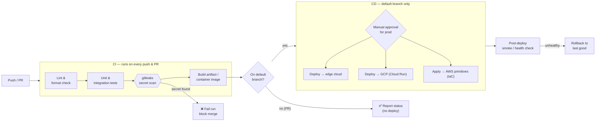

# CI/CD Strategy — Test, Security-Scan, Deploy

> Cross-cutting architecture · author: **Mark Splawn**

## Problem

Shipping code by hand is slow, inconsistent, and unsafe. Across these projects the failure
modes I needed to design out were concrete: a secret slipping into a commit, a regression
reaching production because "the tests passed locally," and deploys that only one person
knows how to run. At the same time, the multi-cloud estate means deploys target several very
different runtimes (an edge platform, containerized GCP services, and a few AWS primitives),
so the pipeline has to be **uniform in policy but flexible in target**.

I wanted one pipeline shape that every repo adopts, where the **safe path is the only path**:
nothing reaches an environment without passing tests *and* a hard secret scan first.

## Architecture

A single linear pipeline with a **hard security gate** between build/test and deploy. The
gate is non-negotiable: a secret finding fails the run, full stop.



### Stage-by-stage

| Stage | Runs when | What it does | Fails the build if… |
|---|---|---|---|
| **Lint & format** | every push/PR | Style + static checks | Lint errors or unformatted code |
| **Test** | every push/PR | Unit + integration tests | Any test fails or coverage drops below the floor |
| **Secret scan** | every push/PR | `gitleaks` across the diff *and* history | **Any** credential-shaped finding |
| **Build** | every push/PR | Produce the artifact / container image | Build error |
| **Deploy** | default branch only | Ship to the correct runtime per target | Deploy error → automatic rollback |
| **Smoke check** | after deploy | Hit health endpoint(s) | Service unhealthy → rollback |

### Branch model

- **Pull requests** run the full CI (lint → test → scan → build) and report status, but
  **never deploy**. A PR cannot merge while any stage is red.
- **The default branch** is the only thing that deploys. A merge to it triggers CD.
- **Production deploys require an explicit manual approval** step; lower environments can be
  fully automatic.

### Why a self-hosted runner

CD runs on a **self-hosted runner** rather than only on hosted CI, because deploys need to
reach private/internal targets and hold scoped deploy credentials that I do not want to
expose to a shared hosted pool. The runner pulls its own credentials from the managed secret
store at job time (see [secrets model](02-secrets-and-least-privilege.md)) and is the single
audited place from which production changes originate. The full reasoning is in
[ADR-0003](../adr/0003-self-hosted-runner-deploys.md).

### Per-target deploy, uniform policy

The *policy* (test, scan, approve, smoke-check, rollback) is identical everywhere. Only the
final deploy command differs by target:

```yaml
# Illustrative pipeline shape (placeholders only — no real values)
deploy:
  needs: [test, secret_scan, build]
  if: branch == "main"
  environment: production            # gated by manual approval
  steps:
    - resolve_secrets_from_store:     # names → values at job time
        - DEPLOY_TOKEN
        - REGISTRY_CREDENTIALS
    - case "$TARGET" in
        edge)  edge-cli deploy --project "$PROJECT" ;;
        gcp)   gcloud run deploy "$SERVICE" --image "$IMAGE" --region "$REGION" ;;
        aws)   terraform apply -auto-approve   # SNS / CloudWatch primitives
      esac
    - smoke_check: curl -fsS "$HEALTH_URL" || rollback
```

## Key decisions & trade-offs

| Decision | Why | Trade-off accepted |
|---|---|---|
| **Hard secret-scan gate** between test and deploy | Leaks are permanent; prevention is orders of magnitude cheaper than cleanup | Rare false positives, handled by an allowlist — never by disabling the scan |
| **PRs test but never deploy** | Keeps `main` releasable and stops half-finished work from shipping | Slightly slower feedback than push-to-deploy |
| **Manual approval for prod** | A human owns the moment of customer impact | A few seconds of latency on prod releases |
| **Self-hosted runner for CD** | Reach private targets; keep deploy creds off shared infra | I operate/patch the runner (acceptable for the control it buys) |
| **Uniform policy, per-target deploy command** | One mental model across three clouds | A small `case` per target instead of one universal command |
| **Auto-rollback on failed smoke check** | A bad deploy self-heals instead of paging at 3am | Need a known-good previous artifact retained (cheap) |

### Why scan history, not just the diff

A scan of the diff alone misses a secret that was committed earlier and only *moved* later.
Scanning history on the default-branch pipeline ensures a credential that ever entered the
repo is caught, which is exactly the condition that forces a rotation. This is the safety net
behind making any repo publishable.

## Tech

- **CI/CD orchestrator:** workflow files committed alongside the code, triggered on
  push/PR/merge.
- **Quality:** language-appropriate linter/formatter; unit + integration test suites with a
  coverage floor.
- **Security:** `gitleaks` (diff + history); optional dependency-vulnerability scan.
- **Deploy targets:** edge CLI, `gcloud`/Cloud Run, Terraform for AWS primitives.
- **Runner:** self-hosted runner that resolves deploy credentials from the managed secret
  store at job time.

## Outcomes

- **"It builds, it's tested, it's scanned, it ships" is the default** — engineers get it for
  free on every push, with no manual checklist.
- **Secrets are gated before a repo or environment** — the scan is a strong safety net that
  trips on credential-shaped findings (a defense in depth, not a guarantee).
- **`main` stays releasable**, because nothing merges red and nothing half-finished deploys.
- **Bad deploys self-recover** via smoke-check + rollback, turning a potential incident into
  a non-event.
- **Deploys are reproducible and auditable** — one runner, one path, one log.

## Related ADRs

- [ADR-0002 — Managed secrets store](../adr/0002-managed-secrets-store.md)
- [ADR-0003 — Self-hosted runner deploys](../adr/0003-self-hosted-runner-deploys.md)
- [ADR-0004 — Terraform as the IaC standard](../adr/0004-terraform-iac.md)
