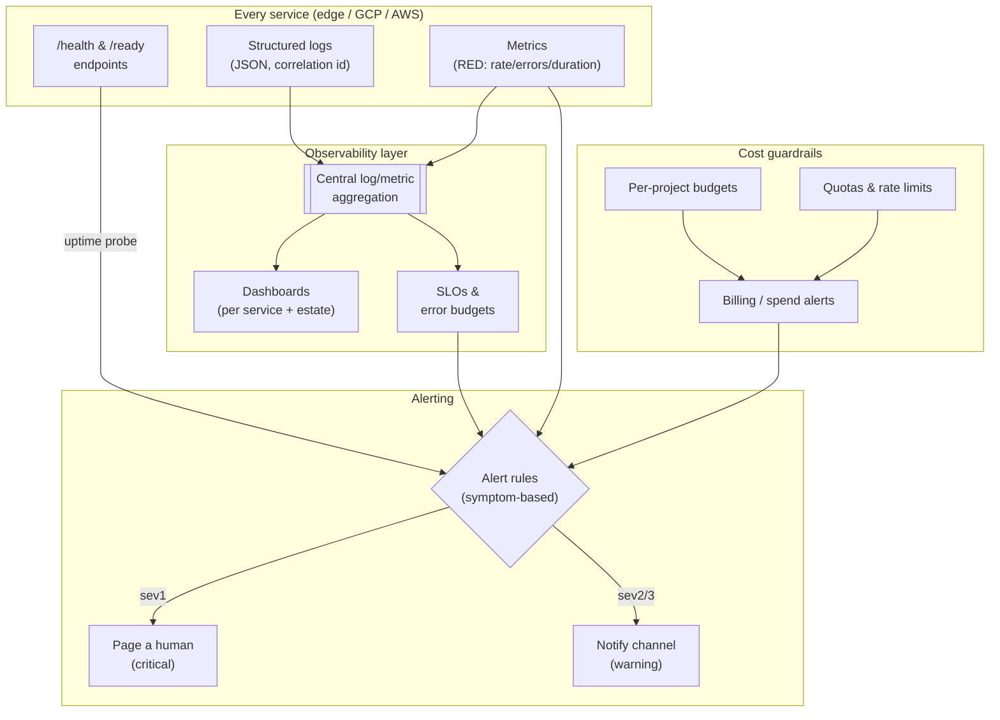

# Observability, Reliability & Cost Guardrails

> Cross-cutting architecture · author: **Mark Splawn**

## Problem

A multi-cloud estate of small services fails in three quiet ways unless you design against
them:

1. **Blind spots** — a service degrades and nobody knows until a user complains.
2. **Fragile recovery** — an outage requires someone to remember undocumented steps under
   pressure.
3. **Runaway cost** — pay-per-use and managed data services are wonderful until a loop, a
   backfill, or a forgotten resource quietly burns the budget. A billing lapse can even
   silently freeze a downstream data pipeline, which is why **cost and billing are best
   treated as operational signals, not just finance line items.**

I design toward one model — meant to apply to any service on any cloud — that makes systems
**observable by default, recoverable by design, and bounded in spend by configuration**.

## Architecture

Three coordinated layers — observability, reliability, and cost — feeding a single set of
alert channels so a human is paged for the *right* things and nothing else.

### Layer 1 — Observability

- **Structured logs everywhere.** Every service emits JSON logs with a **correlation id** so
  a single request can be traced across the edge front door, a GCP worker, and back. Logs are
  shipped to one central aggregation point; no `print`-and-pray.
- **RED metrics per service** — **R**ate, **E**rrors, **D**uration — the three numbers that
  describe almost any request-driven service's health, plus a small set of
  business-meaningful counters where they matter.
- **Health and readiness endpoints** on every service, probed externally so an unreachable or
  failing service is detected independently of its own logs.
- **Dashboards at two altitudes:** one per service for debugging, and one estate-wide "is
  everything green?" view.

### Layer 2 — Reliability

- **SLOs with error budgets.** Each user-facing service has a simple availability/latency
  objective. Alerts fire on **symptoms the user feels** (elevated error rate, latency budget
  burning), not on every internal blip — this is what keeps the pager meaningful.
- **Runbooks for the top failure modes.** Each service's most likely failures have a short,
  written recovery procedure, so recovery is *executing a known plan*, not improvising.
- **Graceful degradation & retries.** Cross-cloud calls assume the network is unreliable:
  timeouts, bounded retries with backoff, and a sensible fallback when a dependency is down,
  so one lane's hiccup doesn't cascade.
- **Automated recovery where cheap.** Failed deploys roll back on a bad smoke check (see
  [CI/CD strategy](03-cicd-strategy.md)); transient worker failures retry; stuck work is
  detected and re-queued rather than silently lost.

### Layer 3 — Cost guardrails

Cost is treated as a non-functional requirement enforced in configuration:

| Guardrail | What it does |
|---|---|
| **Per-project budgets with alerts** | A spend threshold per project trips a notification *well before* month-end, so surprises are caught at 50/80/100% — not on the invoice |
| **Quotas & rate limits** | API and job concurrency are capped so a bug or abuse can't run up an unbounded bill |
| **Right-sized, scale-to-zero compute** | The edge front door and serverless containers idle at (near) zero cost; nothing pays for capacity it isn't using |
| **Data-gravity discipline** | Keeping compute next to data avoids repeated large egress charges (see [multi-cloud strategy](01-multi-cloud-strategy.md)) |
| **Billing health = an operational signal** | Billing/spend anomalies route into the *same* alerting as outages, because a billing lapse can silently break a data pipeline |

### Alert philosophy

- **Page for symptoms, not causes.** A human is paged when users are (or are about to be)
  affected. Internal noise becomes a dashboard line, not a 3am page.
- **Two severities, two channels.** Critical → page; warning → notify a channel for
  next-business-day attention.
- **Every alert is actionable** and links to a runbook. An alert with no action is deleted,
  not tolerated — alert fatigue is itself a reliability risk.

## Key decisions & trade-offs

| Decision | Why | Trade-off accepted |
|---|---|---|
| **Central aggregation** of logs/metrics across clouds | One place to debug a cross-cloud request | A small shipping/ingest cost; one more component to keep up |
| **Symptom-based SLO alerts**, not threshold-on-everything | Keeps the pager meaningful; avoids fatigue | Some slow-burn issues surface via dashboards rather than instantly |
| **Budgets + quotas as code/config** | Spend can't silently run away; abuse is bounded | Occasionally a legitimate spike needs a quota bump (a deliberate, reviewed action) |
| **Billing routed into alerting** | A billing lapse is an outage cause, so treat it like one | One more alert source to maintain |
| **Runbooks for top failures only** | High-value coverage without documenting the entire universe | Rare novel failures still need live debugging |

### Why cost belongs in the architecture doc

In pay-per-use and managed-data systems, an architectural choice (where compute runs, whether
something scales to zero, whether a job is rate-limited) *is* a cost choice. Treating spend as
a finance afterthought is how teams get a five-figure surprise. Putting budgets, quotas, and
billing alerts next to the SLOs makes cost a property the system actively defends.

## Tech

- **Logs/metrics:** structured JSON logging with correlation ids; central log/metric
  aggregation; uptime/health probing.
- **Reliability:** per-service SLOs + error budgets; runbooks; retries/backoff;
  smoke-check-driven rollback.
- **Cost:** per-project budget alerts, quotas/rate limits, scale-to-zero compute, billing
  anomaly alerts wired into the alert channels.
- **Alerting:** symptom-based rules → page (critical) / notify (warning), each linked to a
  runbook.

## Outcomes

What this model is built to deliver wherever it is applied:

- **Problems are caught before users report them** — health probes and SLO burn alerts fire
  first.
- **Recovery is a procedure, not a panic** — runbooks plus auto-rollback turn most incidents
  into short, calm events.
- **Spend is bounded by design** — budgets, quotas, and scale-to-zero mean cost tracks usage,
  and a billing problem pages someone instead of silently breaking a pipeline.
- **The pager stays trustworthy** — because it only fires for things a human must act on, it
  stays worth responding to.

## Related ADRs

- [ADR-0005 — Monitoring, alerting & cost guardrails](../adr/0005-monitoring-alerting.md)
- [ADR-0001 — Multi-cloud workload split](../adr/0001-multi-cloud-split.md)
