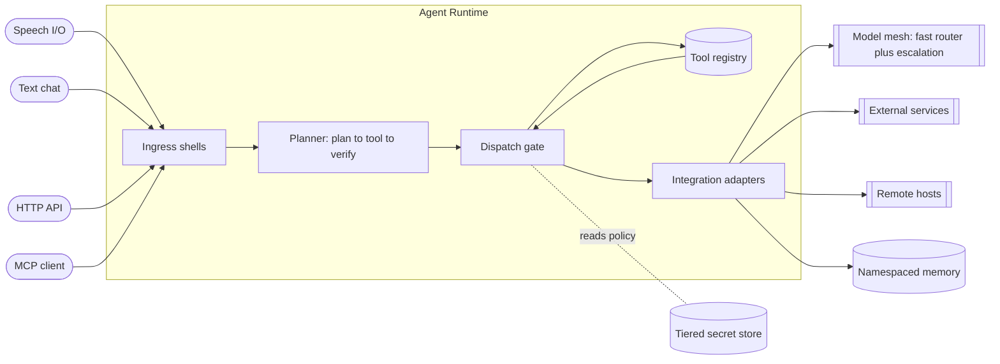

# AI Agent Platform — a deployable framework for building tool-using AI agents

A provider-agnostic runtime for building an intelligent assistant that listens,
reasons, and *acts* — safely — across your real systems. It accepts input over speech or
text, routes intent through a planning loop, dispatches to a governed registry of
tools, and integrates with the services you already run, all while keeping secrets
and personal data out of the codebase.

I designed and built this as a reusable framework. It is not tied to any one
vendor model, any one chat surface, or any one business: the same core powers a
voice assistant, a chat bot, an HTTP API, and a Model Context Protocol (MCP)
server from a single planner. Bring your own large language model, register your
own tools, point it at your own integrations, and deploy.

> **Status:** reference framework + setup guide. Every code sample in this repo
> uses environment-variable placeholders — there are no real secrets, hostnames,
> or credentials anywhere in this tree.

---

## The problem this solves

Most agent projects start as a thin wrapper around a single model API and
collapse the moment they have to do real work. Three failures show up again and
again:

1. **No safety boundary between "thinking" and "doing."** The model is handed raw
   access to shell commands, file writes, and outbound messages. One bad
   completion ships a destructive action to production.
2. **Vendor lock-in.** The orchestration logic is welded to one model provider's
   SDK and tool-call format. Switching models — or running a cheap local model for
   routing and an expensive hosted model only for hard problems — means a rewrite.
3. **Secrets scattered everywhere.** API keys land in source, in committed config,
   in process arguments. The repository becomes unshippable and every leak is a
   production incident.

This framework treats all three as first-class architecture problems rather than
afterthoughts.

---

## What it is

A small, hexagonal **agent runtime** with five replaceable layers:

| Layer | Responsibility |
|---|---|
| **Ingress** | Accept a request over voice, text, HTTP, or MCP. Thin shells — they normalize input and pick an output formatter, nothing more. |
| **Planner** | A bounded *plan → tool → verify* agent loop with a deterministic fast-path for trivial requests. One planner serves every ingress. |
| **Tool registry** | A typed catalog of every action the assistant can take, each tagged with a trust tier, a cost estimate, and capability flags. |
| **Dispatch gate** | The single chokepoint every tool call passes through: schema validation, trust-tier filtering, consent, budget, and freshness checks. |
| **Integrations & stores** | Provider-agnostic adapters to language models, external services, remote hosts, the filesystem, namespaced memory, and a tiered secret store. |

The defining idea is that **the model proposes and the gate disposes.** The
language model is never trusted to decide on its own that a destructive action is
safe; that decision is enforced in code, declaratively, per tool.

---

## Who it is for

- **Solo builders and indie operators** who want a capable assistant wired into
  their own tools without standing up a heavyweight platform.
- **Small teams** who need an internal "do-er" bot (run a report, file a draft,
  check a system, summarize a feed) with real guardrails on what it can touch.
- **Businesses** evaluating an agent platform that must be auditable,
  cost-bounded, and not married to a single model vendor.
- **Engineers** who want a clean reference for how to structure a tool-using agent
  — registry, policy gate, adapters, ingress — rather than a tangle of prompt
  glue.

---

## Capabilities

- **Multi-channel I/O from one brain.** Speech in / speech out, text chat, a JSON
  HTTP endpoint, and an MCP server all delegate to the same planner. Add a channel
  by writing a thin shell, not a new agent.
- **Provider-agnostic model mesh.** Route everyday turns through a fast, cheap
  model (local or hosted) and *escalate* hard problems to a stronger model. Models
  are wired in behind a uniform adapter contract, so swapping or adding a provider
  is mechanical.
- **Governed tool registry.** Every capability is a typed descriptor with a trust
  tier, destructive flag, consent flag, cost estimate, and timeout. The dispatch
  gate enforces these tiers in code, so a low-trust entry point cannot invoke a
  high-trust tool no matter what the model proposes.
- **Declarative safety policy.** A confirmation gate for destructive actions, a
  dry-run override for anything that mutates durable state, a per-call and
  per-window cost budget, and a "require fresh world-state before acting" check —
  all enforced centrally, not sprinkled through prompts.
- **Tiered secret storage.** Secrets live in a single store outside the
  repository, bootstrapped from environment variables. The codebase references
  *names*, never values.
- **Flexible auth.** Supports both service-account credentials (for
  machine-to-machine integrations) and user-delegated OAuth (for acting on a
  person's own accounts), with runtime scope narrowing.
- **Namespaced memory.** Persistent memory is partitioned so multiple identities
  or projects sharing one runtime do not read each other's context.
- **Channel-aware output.** A reporting layer shapes the final reply per channel
  (plain prose for speech, light markdown for chat, structured JSON for APIs).

---

## Architecture at a glance



The full runtime diagram, request lifecycle, and trust model are in
[`docs/architecture.md`](docs/architecture.md).

---

## Design highlights (Solutions-Architect view)

**Problem → Architecture → Trade-offs → Outcome**, recorded as decision records in
[`docs/adr/`](docs/adr):

- [ADR-0001 — Agent loop over a rule-based router](docs/adr/0001-agent-loop-vs-rule-router.md):
  why a bounded planning loop beats a hand-maintained intent tree, and how a
  deterministic fast-path keeps cost and latency down.
- [ADR-0002 — Tiered secret storage](docs/adr/0002-tiered-secret-storage.md): a
  single out-of-repo store bootstrapped from environment variables, so the
  repository is always shippable and rotation is one operation.
- [ADR-0003 — Provider-agnostic LLM mesh](docs/adr/0003-provider-agnostic-llm-mesh.md):
  a uniform adapter contract plus a cheap-router / strong-escalation split for
  cost and reliability.
- [ADR-0004 — Service-account vs user-delegated auth](docs/adr/0004-service-account-vs-user-auth.md):
  when to use each, and why scopes are narrowed at runtime regardless of what was
  granted.

---

## Repository contents

```
.
├── README.md                     ← you are here
├── SETUP.md                      ← prerequisites, config, registering tools, deploy
├── docs/
│   ├── architecture.md           ← runtime diagram + request lifecycle + trust model
│   └── adr/                      ← architecture decision records
└── reference/
    ├── project-structure.md      ← recommended folder layout for an implementation
    └── config.sample.yaml        ← annotated config using ENV-VAR placeholders only
```

The `reference/` directory is a **generic blueprint** — a recommended folder
layout and an annotated sample configuration — so you can scaffold your own
implementation. It contains no application code and no secrets.

---

## Getting started

Read [`SETUP.md`](SETUP.md). In short:

1. Provide an LLM endpoint (local or hosted) via environment variables.
2. Point the runtime at a secret store path; export bootstrap secrets as env vars.
3. Register the tools you want the assistant to be able to call.
4. Pick your ingress channel(s) and deploy as a long-running service.

---

## License

Released under the MIT License. Use it, fork it, ship it.
