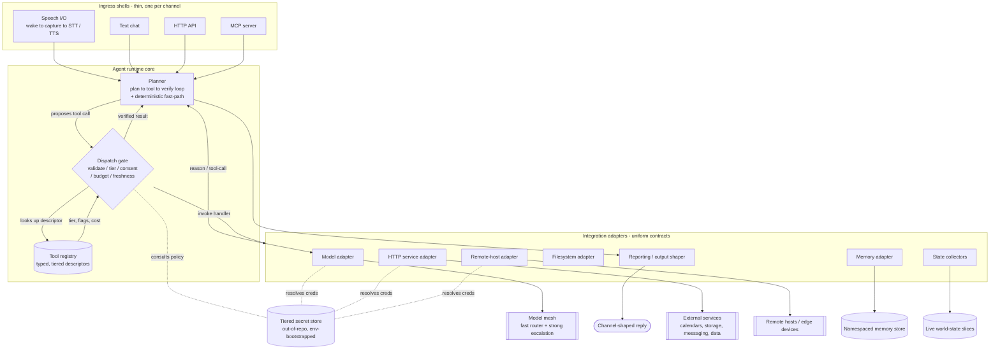
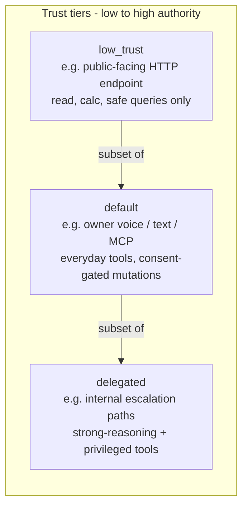
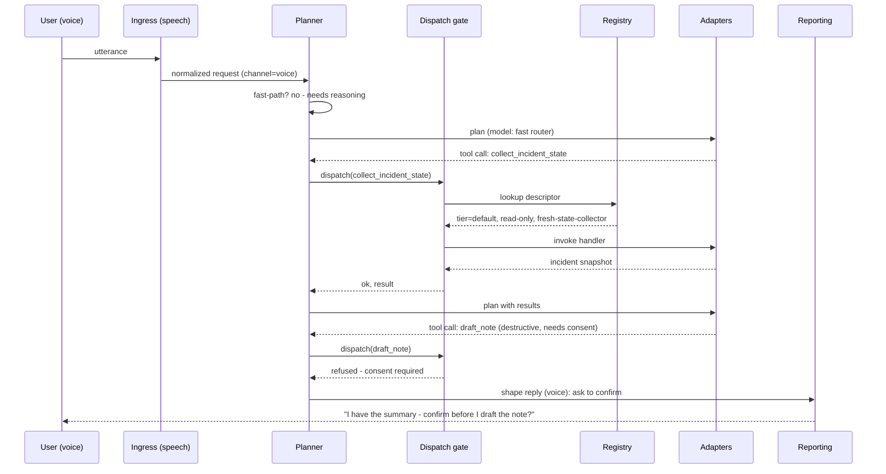

# Architecture

This document describes the runtime: how a request flows from a microphone or an
HTTP call, through intent planning and the tool registry, out to integrations, and
back as a channel-appropriate reply — and where the trust, cost, and secret
boundaries sit.

The guiding principle throughout: **the language model proposes actions; a policy
gate, enforced in code, disposes of them.** Intelligence and authority are
deliberately separated.

---

## 1. Runtime diagram

---

## 2. The five layers

### 2.1 Ingress — many doors, one brain

Each input channel is a **thin shell**. Its only jobs are to (a) turn raw input
into a normalized request and (b) declare which output formatter the reply should
use. It does no reasoning and owns no tools.

| Channel | Input | Output formatting |
|---|---|---|
| **Speech** | Wake detection → voice-activity capture → speech-to-text | Plain prose, no markup or emoji (it will be spoken aloud) |
| **Text** | A chat message | Light markdown |
| **HTTP** | A JSON request to an authenticated endpoint | Raw structured JSON |
| **MCP** | A tool/resource call from an MCP-aware client | Structured result objects |

Because all four delegate to one planner, behavior is identical everywhere and a
new surface is a small adapter — not a fork of the agent. This is the single most
important structural decision in the framework: **channels are pluggable; the
brain is singular.**

### 2.2 Planner — a bounded plan → tool → verify loop

The planner runs an agent loop:

1. **Plan.** Send the conversation plus the available tool catalog to the language
   model.
2. **Act.** If the model emits one or more tool calls, hand each to the dispatch
   gate.
3. **Verify.** Feed tool results back to the model so it can adapt, retry,
   escalate, or finish.
4. **Bound.** The loop has a hard ceiling on iterations and an overall budget, so
   it cannot spin indefinitely or burn unbounded cost.

A **deterministic fast-path** short-circuits trivial, unambiguous requests (a
greeting, a status read, a canned lookup) before the loop ever calls a model. This
keeps the median request cheap and fast while reserving full reasoning for
requests that need it. The rationale is captured in
[ADR-0001](adr/0001-agent-loop-vs-rule-router.md).

> **Model-call normalization.** Some models return tool calls in a structured
> field; others embed them as text in the message body. The model adapter
> normalizes both into one shape before the planner sees them, so the loop never
> contains provider-specific parsing.

### 2.3 Tool registry — a typed catalog of everything the agent can do

Every action is a **typed descriptor**, not an ad-hoc function the model can reach.
A descriptor carries:

- `name`, `description`, and a JSON-schema parameter spec (what the model sees).
- `handler` — the adapter method actually invoked.
- `category` — a grouping used by prompts and reporting.
- `destructive` — does this change durable state (write a file, send a message,
  run a remote command)?
- `needs_consent` — must a human explicitly confirm before this fires?
- `tier` — which class of caller is allowed to invoke it (see §3).
- `cost_estimate` and `timeout` — fed to the budget and timeout enforcement.
- Capability flags such as *"a weak router model may not make the final call on
  this tool"* and *"this tool must not run without freshly-collected world
  state."*

Tools are registered at startup. The registry is the **single source of truth**
for what the assistant can do; nothing executes that is not described here.

### 2.4 Dispatch gate — the one chokepoint

Every tool call — from every channel, from every model — passes through one gate.
In order, it:

1. **Type-checks** the arguments.
2. **Drops unknown arguments** and **enforces required ones** against the schema.
3. **Forces dry-run** on destructive tools that support it, unless a caller has
   explicitly opted out — so the default behavior of any mutating action is to
   *simulate*.
4. **Requires consent** for destructive tools flagged as needing it; without an
   explicit confirmation in the request context, the call is refused.
5. **Filters by trust tier.** A low-trust caller (e.g. an exposed HTTP endpoint)
   cannot dispatch a higher-tier tool: the gate enforces the tier boundary in
   code, regardless of what the model asked for.
6. **Enforces the model-class boundary.** If a weak/cheap router model is driving
   and the tool is marked as requiring strong reasoning, the gate refuses and
   suggests escalation to a stronger model.
7. **Requires fresh state** for tools whose correctness depends on current
   world-state, refusing if the relevant state slice is stale.
8. **Checks the cost budget** (per-call and per-window).
9. **Invokes** the handler, **records cost** to a ledger, and returns a
   `(ok, result)` pair.

When the gate refuses, it returns a human-readable reason that the planner feeds
back to the model — so the agent can adapt or escalate rather than simply failing.
This is where the framework's safety lives, and it lives in *one auditable place*.

### 2.5 Integrations & stores — uniform adapter contracts

The core never imports a concrete vendor module. It depends only on a small set of
**adapter contracts** (interfaces). Each external dependency satisfies one
contract:

| Contract | Wraps | Examples of what plugs in |
|---|---|---|
| **Model adapter** | A chat-completion model with tool use | A local model server; a hosted model API |
| **CLI / subprocess adapter** | A command-line reasoning tool invoked non-interactively | An escalation model exposed as a CLI |
| **HTTP service adapter** | Any REST/JSON service | Calendar, storage, messaging, search, data APIs |
| **Remote-host adapter** | Authenticated command execution on another machine | An edge device or a worker node over a private network |
| **Filesystem adapter** | Local file read/write on the execution host | Scratch space, artifact output |
| **Memory adapter** | Namespaced persistent memory | A local DB or vector store |
| **State collectors** | Fast, idempotent snapshots of live world-state | Node health, service status, account balances |
| **Reporting adapter** | Final-form text shaping per channel | Voice/text/HTTP/MCP formatters |

Adding a vendor means writing one file that satisfies one contract and registering
it. No core code changes. This is what makes the model layer **provider-agnostic**
([ADR-0003](adr/0003-provider-agnostic-llm-mesh.md)) and what keeps the blast
radius of any integration small.

---

## 3. The trust model

Three tiers map to three classes of caller. The dispatch gate enforces that a
caller may invoke tools **at its tier or below, never above.**

- **low_trust** — for any ingress you do not fully control or that is exposed to a
  broader audience. It can read and compute but cannot mutate or reach privileged
  tools.
- **default** — the everyday tier for a trusted operator surface. Destructive
  tools here still require consent.
- **delegated** — internal, trusted escalation, where strong-reasoning and
  higher-authority tools live.

A second, orthogonal control is the **model-class boundary**: even within an
allowed tier, a cheap router model may be forbidden from making the *final*
decision on high-stakes tools, forcing an escalation to a stronger model. Trust is
therefore a function of *both* who called and *which model is reasoning*.

---

## 4. Request lifecycle (worked example)

A spoken request, *"summarize today's incidents and draft a status note":*

Note three things in this trace: a read-only tool runs freely; a mutating tool is
**blocked pending consent**; and the reply is shaped for the *voice* channel. The
same request over the HTTP channel would return JSON and carry the consent flag in
the request body.

---

## 5. Cross-cutting concerns

### Security
- Secrets never enter the repository or process arguments. They are resolved at
  runtime from a tiered store, bootstrapped from environment variables
  ([ADR-0002](adr/0002-tiered-secret-storage.md)).
- Authority is enforced in code at the gate, not requested via prompt text. A
  jailbroken prompt cannot grant itself a higher tier.
- Destructive actions default to dry-run and require consent.
- Auth supports machine identities (service accounts) and user-delegated OAuth
  with runtime scope narrowing ([ADR-0004](adr/0004-service-account-vs-user-auth.md)).

### Reliability
- The agent loop is bounded in both iterations and cost.
- The cheap-router / strong-escalation split means a single model outage degrades
  rather than disables the system.
- State collectors are idempotent and TTL-cached; stale state blocks
  state-dependent actions instead of acting on bad data.

### Cost
- Every tool carries a cost estimate; the budget gate enforces per-call and
  per-window ceilings and writes a cost ledger.
- The fast-path and the cheap-default-model policy keep the common case
  inexpensive; spend is concentrated on genuinely hard requests.

### Scalability & extensibility
- New channels, new tools, and new providers are all additive: a shell, a
  registry entry, or an adapter — never a core rewrite.
- Memory is namespaced, so one runtime can safely serve multiple identities or
  tenants without context bleed.

---

## 6. Deliberate non-goals

- **Not a model.** This is the runtime *around* a model; bring your own.
- **Not a UI.** Ingress is programmatic; build whatever front-end you like on top
  of the HTTP or MCP surface.
- **Not a workflow engine.** It orchestrates tool calls within a request; for
  large scheduled pipelines, pair it with a dedicated scheduler and expose that
  scheduler as a tool.
