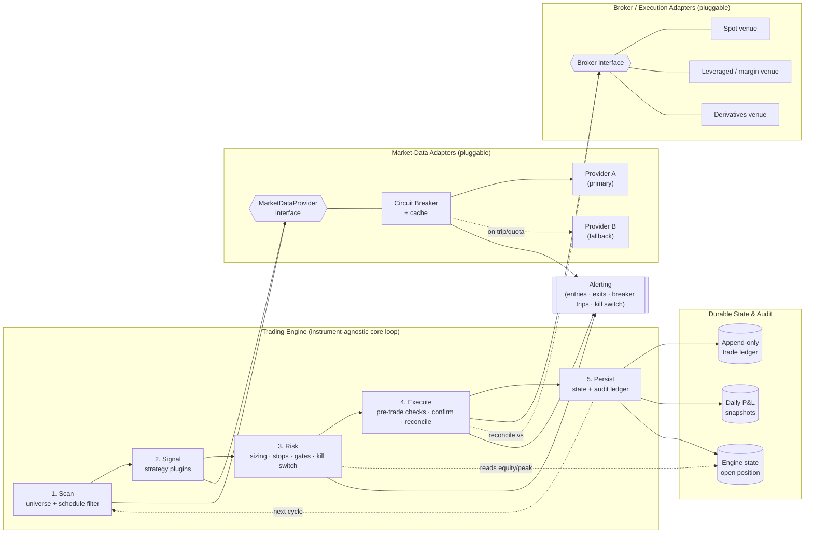

# Algorithmic Trading Platform

A modular, instrument-agnostic engine for running multiple systematic trading
strategies against live markets — with capital protection, pluggable market-data
and broker adapters, and a fully auditable trade ledger at its core.

> **Status:** Reference architecture and engineering case study. The code
> excerpts below are illustrative and use placeholders (`ENV_VAR` names, fake
> symbols) in place of any real credentials, accounts, or instruments.

---

## TL;DR

I designed and built a trading platform that treats **risk and reliability as
first-class concerns**, not afterthoughts. The same engine runs several
strategy families across different asset classes (spot, leveraged, derivatives)
by abstracting away *where prices come from* and *who fills orders*. Every
external dependency sits behind a circuit breaker, every order path is built to
survive a crash or a duplicate, and capital is defended by a layered risk model
with a hard kill switch.

The interesting engineering here is not the indicators — it is everything around
them: **failing safe when a data feed dies, reducing duplicate-order risk on a
network retry, reconciling state against the broker as the source of truth, and a
backtesting + research harness for developing and screening strategies before
committing capital.**

I have run this platform on real capital and iterated on it through many
backtests. A forex strategy is live now; a crypto strategy traded live earlier
and is currently stopped; an options path is in development on paper (not live
money). Results have been roughly breakeven — I am **not** claiming a validated
edge or market-beating returns. The story I'm proud of is the *engineering and
the research discipline*: building the harness, running the experiments, and
killing strategies that didn't hold up rather than talking myself into them.

---

## 1. Problem

Most retail and prototype trading bots share the same fatal flaws, and I set out
to engineer around all of them:

| Common failure mode | Real-world consequence |
|---|---|
| **Tightly coupled to one data vendor / one broker** | A vendor price change, rate-limit, or outage takes the whole system down; switching providers is a rewrite. |
| **No capital protection** | A bad model, a flash crash, or a runaway loop drains the account before anyone notices. |
| **Non-idempotent execution** | A timeout on "place order" triggers a retry that opens a *second* position; the bot now holds 2x the intended risk. |
| **In-memory state only** | A process restart loses the open position; the bot either forgets it (no exit) or re-enters (double exposure). |
| **Backtests that lie** | Look-ahead bias and zero-cost fills produce a beautiful equity curve that evaporates in live trading. |
| **No observability** | When something goes wrong with real money, there is no durable record of what happened or why. |

The goal: a platform where **a strategy is a small, swappable plugin**, the
**data and execution layers are swappable adapters**, and the **risk, state, and
audit layers are shared, hardened infrastructure** that every strategy inherits
for free.

---

## 2. Architecture

The engine runs a deterministic loop — **scan → signal → risk → execute →
persist** — over a universe of instruments. Strategies, market-data providers,
and brokers are all plugged in behind stable interfaces, so none of the core
loop knows or cares which concrete implementation is wired up.



A deeper view of the components, data flow, and failure handling lives in
[`architecture.md`](./architecture.md).

### The five stages

1. **Scan** — Iterate the configured instrument universe, throttled to respect
   provider rate limits. A pluggable schedule filter can skip known dead periods
   (e.g. low-liquidity hours, market-closed windows) and an adaptive ranker can
   reorder the universe so the most promising instruments are checked first
   within a bounded API budget.

2. **Signal** — Each enabled **strategy plugin** receives OHLCV history and
   emits an immutable `Signal` (direction, reference price, stop model, one or
   more take-profit levels) **or nothing**. Strategies are pure functions of
   market data with a strict no-look-ahead contract: a signal computed on the
   close of bar *i* may only be acted on at the open of bar *i+1*.

3. **Risk** — The shared risk layer is the gatekeeper. It sizes the position
   from account equity and stop distance, applies an expected-value gate and
   optional confirmation filters, and checks the **kill switch** before anything
   reaches the broker. No strategy can bypass it.

4. **Execute** — The execution layer talks to the broker adapter through a
   narrow interface. It runs **pre-trade safety checks** (e.g. price-impact /
   spread limits), submits the order, **confirms the fill**, retries safely on
   settlement lag, and treats the broker as the source of truth for what the
   account actually holds.

5. **Persist** — Every fill is written to an **append-only ledger** independent
   of the engine's working state, daily P&L snapshots are upserted, and the open
   position is checkpointed so a restart resumes exactly where it left off.

---

## 3. Key Decisions & Trade-offs

### 3.1 Provider abstraction with a circuit breaker (reliability + cost)

Market-data vendors fail, throttle, and change quotas. I put **every provider
behind a single `MarketDataProvider` interface** with a normalized OHLCV/price
shape, then wrapped it with a **circuit breaker, a TTL cache, and a fallback
chain**.

- On a quota/rate-limit response, the breaker **trips** for a cool-off window,
  the engine fails *safe* (no signal rather than a stale or wrong one), and an
  alert fires once.
- A cheaper/free **fallback provider** can serve the same shape when the primary
  is unavailable, so a single vendor outage degrades gracefully instead of
  halting trading.
- The breaker's tripped/healthy state is **persisted**, so a process restart
  doesn't silently lose it and pin the dashboard in a wrong state forever.
- **Trade-off:** an extra normalization layer per provider and the discipline of
  keeping adapters in lock-step on their contract. Worth it — adding or swapping
  a vendor became a one-file change, and runaway API cost is bounded by the
  cache, the capped scan universe, and throttling at this single chokepoint. See
  [ADR-0001](./adr/0001-market-data-provider-abstraction.md).

### 3.2 A layered risk model, not a single stop-loss (capital protection)

Risk is enforced in **independent layers**, each able to veto a trade:

- **Position sizing** — risk a fixed fraction of equity per trade, derived from
  the stop distance (smaller stop → larger size for the same dollar risk), with
  an optional **fractional-Kelly** mode above a capital threshold for
  compounding.
- **Stop & target models** — pluggable: fixed-percentage, **R-multiple**
  (reward expressed as a multiple of risk), and volatility-/structure-based
  (ATR or recent swing). Strategies declare *what* stop model they want; the
  risk layer computes the levels.
- **Expected-value gate** — block entries whose modelled EV doesn't clear a
  minimum, so the system stays idle when its own model doesn't favour a trade.
- **Kill switch** — a hard floor on equity. Breach it and the engine stops
  opening positions entirely; it re-arms only after capital recovers above a
  higher reset threshold (hysteresis prevents flapping around the boundary).
- **Drawdown awareness** — peak equity is tracked continuously to feed
  drawdown-based logic and reporting.

**Trade-off:** more configuration surface and more states to reason about. The
payoff is that *a single bug in a strategy is far less likely to drain the
account* — the risk layer is the last line of defense and it is shared, tested
infrastructure. It bounds losses **assuming the stop and kill switch fire and the
broker honors them**; it is defense in depth, not a guarantee. See
[ADR-0002](./adr/0002-layered-risk-model-and-kill-switch.md).

### 3.3 Idempotent execution with the broker as source of truth (correctness)

The single most dangerous bug in live trading is a **duplicate order from a
retry**. My execution layer is designed to *reduce the risk that the same logical
intent results in two positions*:

- **Confirm-then-commit:** local state is only marked "in position" *after* the
  fill is confirmed on the venue. A timeout mid-submit never leaves the engine
  believing it's flat when it isn't (or vice versa).
- **Broker as source of truth:** on every cycle and on startup, the engine
  reconciles its state against the venue. It **adopts** positions it finds but
  isn't tracking (e.g. opened manually), and **clears phantom** positions whose
  balance has effectively vanished (dust threshold), so it never monitors a
  position that no longer exists or ignores one that does.
- **Settlement-lag retries:** after a fill, balance/position reads are retried
  with backoff because venues can briefly lag; state is only committed once the
  position is observable.
- **Fail-safe on exit:** if a close order fails, state is *preserved* for retry
  rather than optimistically wiped — better to re-attempt an exit than to
  "forget" an open position.

**Trade-off:** the happy path costs extra round-trips (confirm + reconcile) and
the logic is more involved than fire-and-forget. For real money, paying
milliseconds and code complexity to drive toward at-most-once exposure is an easy
call. See [ADR-0003](./adr/0003-idempotent-execution-and-reconciliation.md).

### 3.4 Durable, append-only audit separate from working state

Engine working state (the current open position) is small and mutable; the
**trade history is sacred**. I split them deliberately: working state is a
checkpoint that can be rebuilt, while every fill is appended to a durable ledger
(plus daily P&L snapshots) that **survives state corruption** and is the basis
for performance reporting and post-mortems. Closing actions and opening actions
are tagged so P&L aggregation never double-counts.

### 3.5 A backtesting + research harness for developing and screening strategies

Strategies are developed and screened in a backtester engineered to be
**pessimistic and look-ahead-free**, so the research process pushes back on
wishful thinking rather than flattering it:

- Signals fire on bar close, fills happen at the *next* bar's open.
- Fills are charged realistic **spread + slippage**, always in the worse
  direction.
- When both stop and target fall inside the same bar, the **stop wins**
  (conservative).
- Higher-timeframe context uses **completed bars only**.
- Results are examined with **walk-forward analysis** (rolling train/test
  windows) and scored on **out-of-sample behaviour** — profit factor,
  expectancy, drawdown stability, and sample size — to surface the ones that look
  curve-fit. This is a screening and research tool, not proof of an edge:
  in-sample numbers do not guarantee live results, and I have killed strategies
  here that didn't survive out-of-sample. Backtest survival informs the decision
  to risk capital; it does not by itself validate one.

---

## 4. Tech & Design Principles

- **Language/runtime:** Python (the engine core is plain, dependency-light, and
  testable; numerical backtesting uses vectorized arrays).
- **Interfaces over implementations:** `Strategy`, `MarketDataProvider`, and
  `Broker` are the three seams that make the platform extensible. New asset
  class? Add a broker adapter. New vendor? Add a data adapter. New strategy idea?
  Add a strategy plugin. The core loop never changes.
- **Pure, stateless strategy & risk math:** sizing, stop, and signal functions
  take inputs and return values with no side effects — trivial to unit-test and
  reuse between the live engine and the backtester.
- **Fail safe, not fail open (for trading):** when data is missing or a breaker
  is tripped, the engine declines to trade. Soft confirmation filters "fail
  open" (don't block on a flaky third-party signal), but anything touching
  capital fails safe.
- **Persistence everywhere it matters:** breaker state, open-position
  checkpoint, append-only ledger, daily snapshots — designed to make crashes and
  restarts non-events.
- **Config-driven, secret-free:** all credentials and tunables come from
  environment variables / a secrets store (e.g. `BROKER_API_KEY`,
  `DATA_PROVIDER_KEY`, `RISK_PER_TRADE_PCT`, `KILL_SWITCH_FLOOR`); nothing
  sensitive is ever in source.
- **Observability:** structured logs plus push alerts for the events that matter
  at 3 a.m. — entries, exits, breaker trips, and kill-switch activation.

### Illustrative interfaces

```python
# Strategy plugin contract — pure function of market data, no look-ahead.
class Strategy(ABC):
    name: str

    @abstractmethod
    def generate_signals(self, candles, htf_candles=None, *, symbol, timeframe) -> list[Signal]:
        """Signal on bar i's close is executed at bar i+1's open. HTF = completed bars only."""
        ...

# Market-data adapter contract — normalized shape across every vendor.
class MarketDataProvider(ABC):
    @abstractmethod
    def get_ohlcv(self, symbol: str, interval: str, count: int) -> list[Candle] | None: ...
    @abstractmethod
    def get_price(self, symbol: str) -> float | None: ...

# Broker adapter contract — the engine never speaks a venue's native dialect.
class Broker(ABC):
    @abstractmethod
    def place_order(self, symbol: str, units: int, sl_price=None, tp_price=None) -> Fill | None: ...
    @abstractmethod
    def close_position(self, symbol: str) -> Result | None: ...
    @abstractmethod
    def get_open_positions(self) -> list[Position]: ...   # broker is the source of truth
```

```python
# Risk sizing: dollar risk is constant; size scales inversely with stop distance.
def position_size(equity: float, risk_pct: float, entry: float, stop: float) -> int:
    risk_distance = abs(entry - stop)
    if risk_distance == 0:
        return 0
    return max(0, int((equity * risk_pct) / risk_distance))
```

---

## 5. Outcomes

What the architecture delivered, framed as engineering results rather than
returns:

- **Vendor independence in practice.** Migrating the primary market-data source
  to a different provider was a single adapter change with zero edits to
  strategy or engine code — the interface plus fallback chain absorbed it
  completely.
- **Contained failure blast radius.** A data-vendor rate-limit or outage degrades
  to "skip this cycle" or "use the fallback," instead of "crash" or "trade on
  stale data." Breaker state survives restarts.
- **Toward at-most-once exposure.** Confirm-then-commit plus broker reconciliation
  targets the duplicate-position class of bugs; the engine is designed to recover
  cleanly from crashes, mid-trade restarts, and out-of-band manual actions.
- **Capital floor backstop.** The kill switch is designed to bound losses — it
  stops opening positions below a floor that no strategy logic can override, with
  hysteresis so it doesn't thrash. That bound holds assuming the stop and switch
  fire and the broker honors them.
- **Trustworthy performance data.** An append-only ledger independent of working
  state means every trade is auditable after the fact, and P&L reporting is
  reproducible.
- **Research discipline before risk.** The walk-forward + out-of-sample harness
  is how I develop and screen strategies and decide what's worth trading,
  catching over-fit candidates on historical data rather than on the balance
  sheet. It informs the decision to go live; it is not a claim that an edge was
  validated.

---

## 6. Repository Layout (reference)

```
algorithmic-trading-platform/
├── README.md                 # this case study
├── architecture.md           # detailed component & data-flow design
└── adr/
    ├── 0001-market-data-provider-abstraction.md
    ├── 0002-layered-risk-model-and-kill-switch.md
    └── 0003-idempotent-execution-and-reconciliation.md
```

A production implementation of this design would organize as: `core/` (the
scan→persist loop), `strategies/` (plugins), `adapters/data/` and
`adapters/broker/` (pluggable integrations), `risk/`, `persistence/`, and
`backtest/` (engine + walk-forward), with configuration injected from the
environment.

---

## 7. What I'd Build Next

- **Multi-position / portfolio risk** — currently the core defends per-position
  and account-level risk; the next layer is correlation-aware exposure limits
  across simultaneous positions.
- **Event-sourced state** — promote the append-only ledger to the authoritative
  event log and derive working state from it (full replayability).
- **Pluggable execution algos** — TWAP/VWAP/iceberg behind the same `Broker`
  seam for larger size without market impact.
- **Backtest ↔ live parity harness** — run the live engine against recorded
  market data to continuously prove the two paths agree.

---

*Authored by Mark Splawn.*
