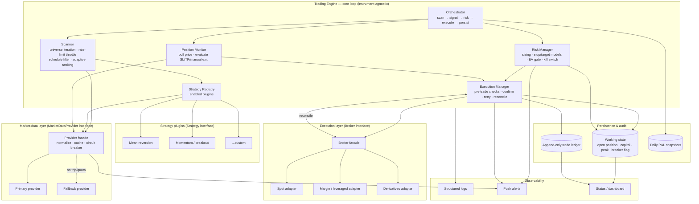
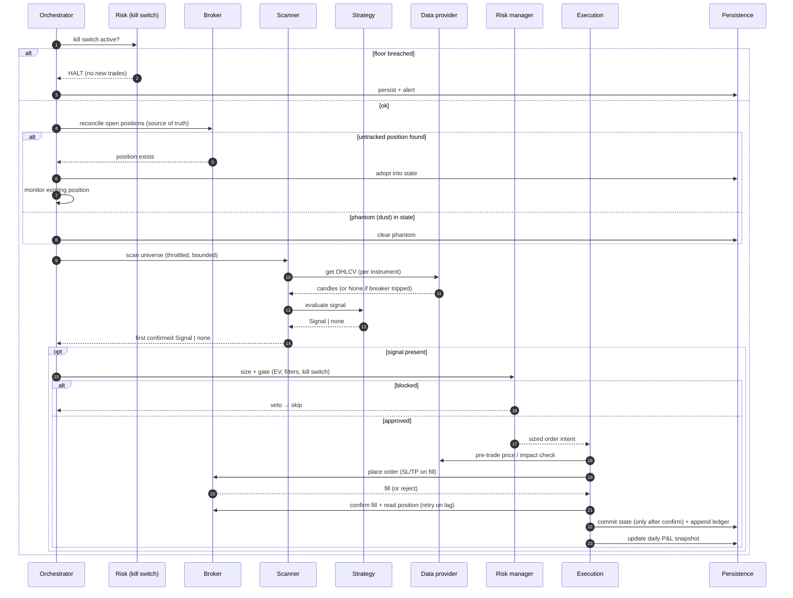
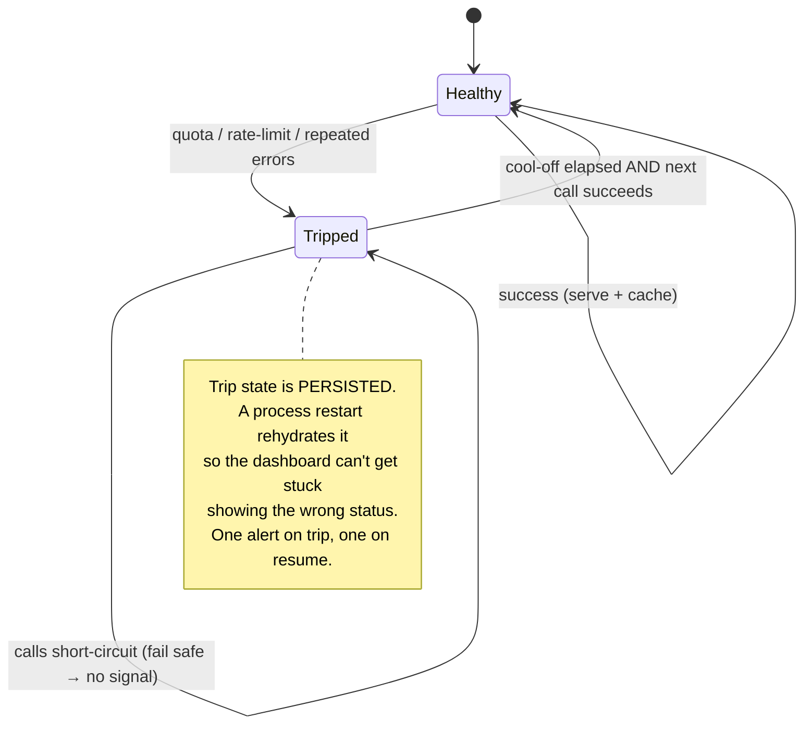
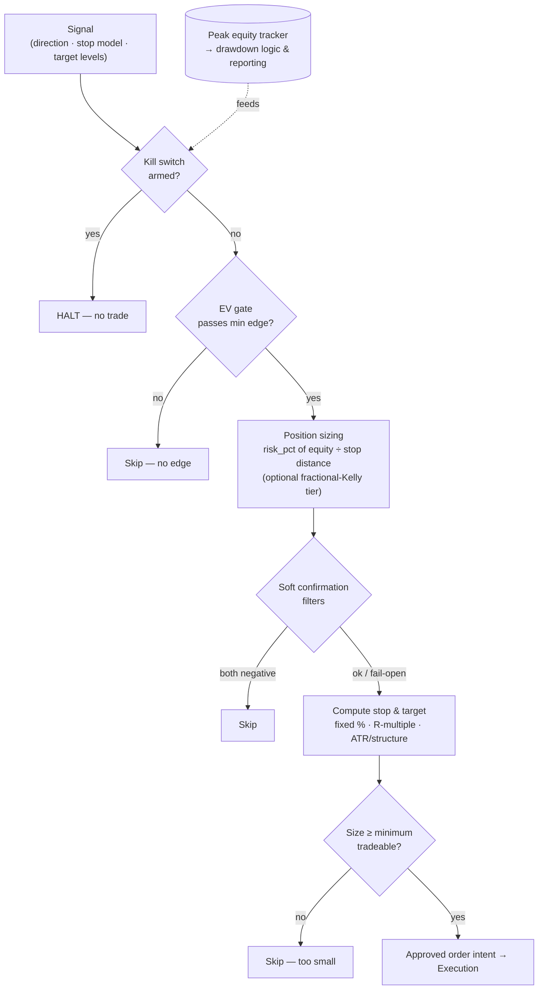
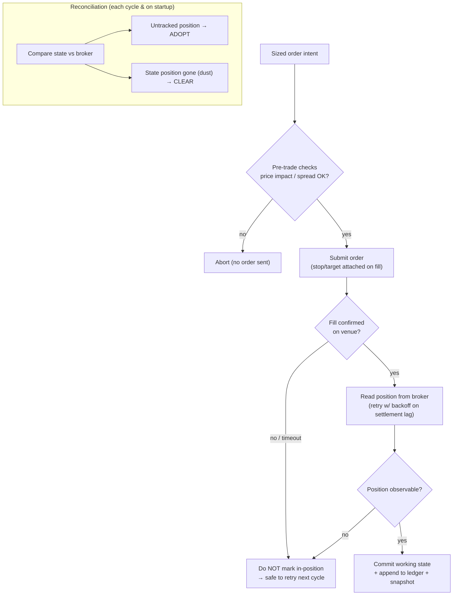
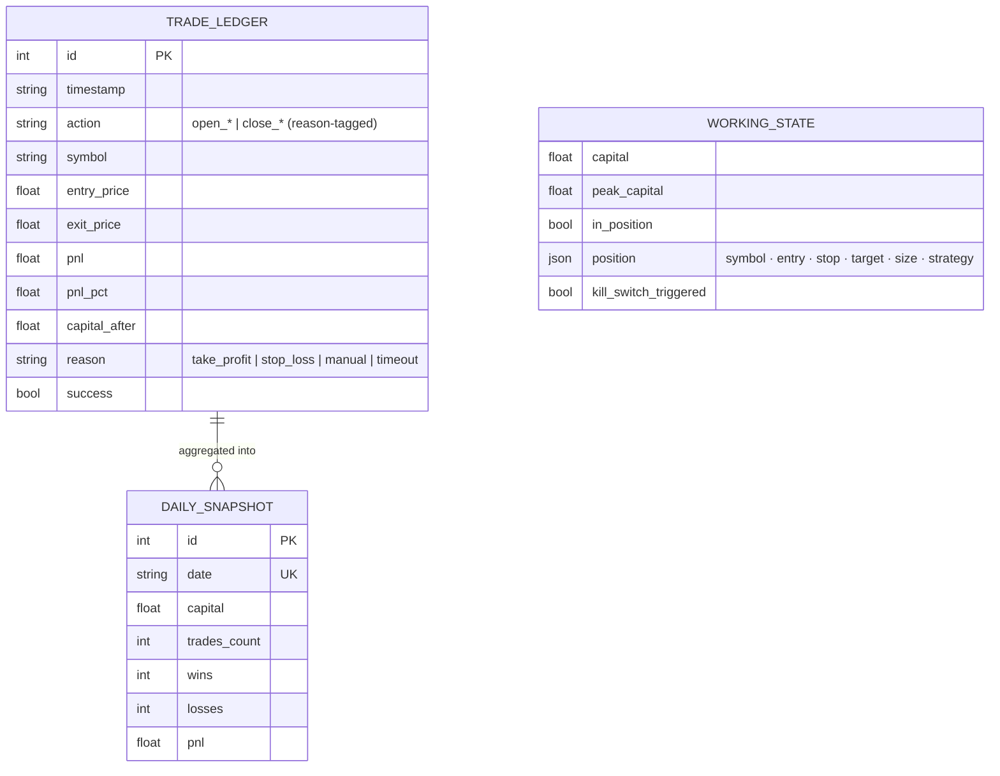
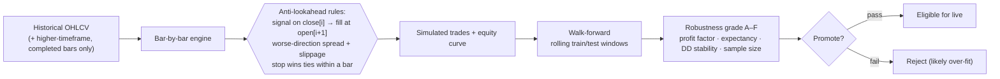
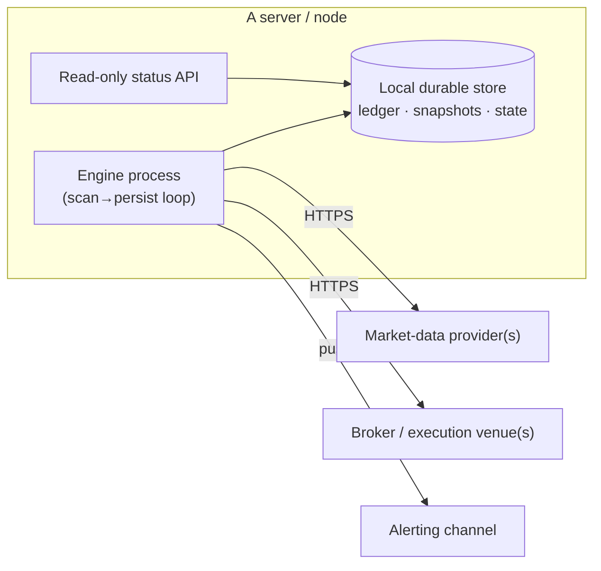

# Architecture — Algorithmic Trading Platform

This document goes one level deeper than the [README](./README.md): the
component model, the end-to-end control flow, the failure-handling design, and
the data model. Everything is **instrument-agnostic** and **vendor-agnostic** by
construction — concrete strategies, data providers, and brokers are plugins
behind stable interfaces.

---

## 1. Design goals (and how the architecture meets them)

| Goal | Mechanism |
|---|---|
| **Reliability** | Circuit breaker + cache + fallback on every external dependency; fail-safe (decline to trade) on missing data. |
| **Correctness with real money** | Confirm-then-commit execution; broker-as-source-of-truth reconciliation; designed for at-most-once exposure. |
| **Capital protection** | Layered, independent risk gates ending in a hard kill switch with hysteresis; bounds losses assuming stop/kill switch fire and the broker honors them. |
| **Extensibility** | Three seams — `Strategy`, `MarketDataProvider`, `Broker`. New asset class / vendor / strategy = one new plugin, zero core changes. |
| **Auditability** | Append-only ledger separate from mutable working state; daily P&L snapshots. |
| **Scalability & cost** | Bounded scan universe, rate-limit throttling, TTL caching, adaptive ranking within an API budget. |
| **Security** | Secret-free source; all credentials/tunables via environment variables or a secrets store. |

---

## 2. Component model

### Responsibilities

- **Orchestrator** — owns the loop and its ordering guarantees. Before scanning,
  it checks the kill switch and reconciles state with the broker.
- **Scanner** — produces candidate instruments. Caps the universe to a bounded
  number per cycle (cost control), throttles between provider calls (rate-limit
  safety), skips configured dead periods, and can rank by recent performance so
  the best candidates are evaluated first within the budget.
- **Strategy Registry / plugins** — each plugin implements `generate_signals`
  and returns immutable `Signal` objects or nothing. Strategies never touch the
  broker, state, or risk directly.
- **Risk Manager** — the only path to an order. Sizes, gates, and can veto.
- **Execution Manager** — the only component that speaks to a broker adapter.
  Owns pre-trade checks, confirmation, retries, and reconciliation.
- **Position Monitor** — once in a position, polls price and triggers exits on
  stop, target, or an out-of-band manual-exit signal.
- **Persistence** — working state (rebuildable checkpoint) vs. audit (sacred,
  append-only).
- **Observability** — logs for everything, alerts for the few events a human
  must know about immediately.

---

## 3. End-to-end control flow

The ordering is deliberate and load-bearing:

1. **Kill switch first** — never even scan if capital is below the floor.
2. **Reconcile before acting** — the broker, not local memory, defines reality;
   adopt orphans, clear phantoms.
3. **Risk before broker** — every order is sized and gated; strategies cannot
   reach the venue directly.
4. **Confirm before commit** — local "in position" is set only after the venue
   confirms, which is what makes retries safe.

---

## 4. Market-data layer & circuit breaker

Every provider implements the same `MarketDataProvider` contract and returns a
**normalized** candle/price shape, so the engine is identical regardless of
vendor. The facade adds three reliability features.

- **Normalization** — each adapter maps its vendor's payload to the canonical
  OHLCV/price model (and reconciles quirks like newest-first vs oldest-first
  ordering, label differences, missing endpoints).
- **TTL cache** — OHLCV is cached for roughly one candle interval, collapsing
  repeated reads within a cycle and cutting API spend dramatically.
- **Circuit breaker** — on a quota/rate-limit signal the breaker trips for a
  cool-off window; while tripped, calls short-circuit and the engine receives
  `None` and **declines to trade** rather than acting on stale data. State is
  persisted and rehydrated on restart.
- **Fallback chain** — when the primary is unavailable (auth/quota), the facade
  can transparently serve from a secondary provider exposing the same shape.

> Why fail *safe* here: a wrong or stale price is more dangerous than no price.
> The engine treats "I don't know the price" as "do not act," which is the
> correct bias when capital is at risk.

---

## 5. Risk model (layered defense)

Layer-by-layer:

- **Kill switch (hard).** A capital floor. Once breached, the engine stops
  opening positions and flags itself; it re-arms only after equity recovers
  above a higher reset threshold. The gap between floor and reset is intentional
  **hysteresis** so the switch can't oscillate at the boundary.
- **Expected-value gate (statistical).** Trades are only allowed when modelled
  EV exceeds a minimum — when the model doesn't favour a trade, the system simply
  waits.
- **Position sizing (proportional).** Dollar risk per trade is a fixed fraction
  of equity; size is derived from the stop distance so risk is constant whether
  the stop is tight or wide. Above a capital threshold, an optional
  **fractional-Kelly** mode scales size for compounding while staying
  conservative (half-Kelly, clamped).
- **Stop & target models (pluggable).** Fixed-percentage, **R-multiple** (target
  as N× the risk distance), and volatility-/structure-based (ATR multiple or
  recent swing high/low). Strategies request a model; the risk layer computes
  the prices.
- **Soft confirmation filters (fail-open).** Optional third-party confirmations
  (e.g. order-flow or sentiment). These *fail open* — a flaky external signal
  must not block an otherwise-valid trade — and only veto when clearly negative.
- **Minimum-size guard.** Reject orders too small to be economical.

This is the heart of the platform's value: **a strategy bug is far less likely to
be ruinous**, because the shared risk layer is the last gate and the kill switch
is the backstop. The bound holds assuming the stop and kill switch fire and the
broker honors them — it is layered defense, not an absolute guarantee.

---

## 6. Idempotent execution & reconciliation

The execution layer is designed for **at-most-once exposure** per logical intent.

Key invariants:

- **Confirm-then-commit.** Working state flips to "in position" only after the
  venue confirms the fill. A crash or timeout between submit and confirm leaves
  the engine able to discover the truth on the next reconciliation rather than
  guessing.
- **Broker is source of truth.** Local state is a cache of the venue's reality
  and is reconciled against it continuously — adopting positions opened
  out-of-band and clearing positions that no longer exist (using a dust
  threshold so fractional leftovers don't trap the engine).
- **Settlement-lag tolerance.** Post-fill reads retry with backoff because
  venues can briefly lag; nothing is committed until the position is observable.
- **Fail-safe exits.** If a close order fails, state is **preserved** so the
  exit is retried — the engine never "forgets" an open position by optimistically
  clearing it.

---

## 7. Persistence & data model

Two stores with very different durability requirements:

- **Working state** (small, mutable, rebuildable): current open position, last
  known capital, peak equity, kill-switch flag, breaker flag. Checkpointed so a
  restart resumes mid-trade.
- **Audit** (append-only, durable): every fill written as an immutable row, plus
  upserted daily P&L snapshots. This is independent of working state so it
  **survives state corruption** and is the single basis for performance
  reporting.

P&L aggregation reads **only** reason-tagged closing rows, so open and close
events are never double-counted — a small but important correctness detail for
trustworthy reporting.

---

## 8. Backtesting & research pipeline

Strategies are developed and screened in a deliberately pessimistic,
look-ahead-free backtester and examined out-of-sample before they're considered
for live capital. This is a research and screening pipeline — it informs the
decision to go live and weeds out over-fit candidates, but it does not by itself
validate an edge.

The same **pure** sizing and stop functions used live are used in the
backtester, so the simulated and live risk behavior are the same code — not two
implementations that can drift.

---

## 9. Cross-cutting concerns

- **Configuration & secrets** — every credential and tunable is injected from
  the environment / a secrets store (`BROKER_API_KEY`, `BROKER_ACCOUNT_ID`,
  `DATA_PROVIDER_KEY`, `RISK_PER_TRADE_PCT`, `KILL_SWITCH_FLOOR`,
  `KILL_SWITCH_RESET`, `MAX_SCAN_INSTRUMENTS`, `SCAN_INTERVAL`). Source contains
  names, never values.
- **Time & scheduling** — scans are interval-driven; a schedule filter avoids
  known low-quality windows. Cron-style scheduling can drive periodic reporting.
- **Observability** — structured logs for the full loop; push alerts reserved
  for entries, exits, breaker trips, and kill-switch events; a read-only status
  surface derives from working state and the ledger.
- **Testing** — pure strategy/risk/stop functions are unit-tested in isolation;
  the backtester doubles as an integration test of the decision path against
  recorded data.

---

## 10. Deployment shape (reference)

The engine is a long-running process (one per trading domain) plus a lightweight
read-only status surface. It is deliberately modest to operate:

Because the engine is built to be safe across restarts (it rebuilds from the
durable store and reconciles against the broker), it is designed to be restarted,
redeployed, or moved between hosts while preserving position integrity — which is
exactly what the architecture set out to do.

---

*Authored by Mark Splawn.*
