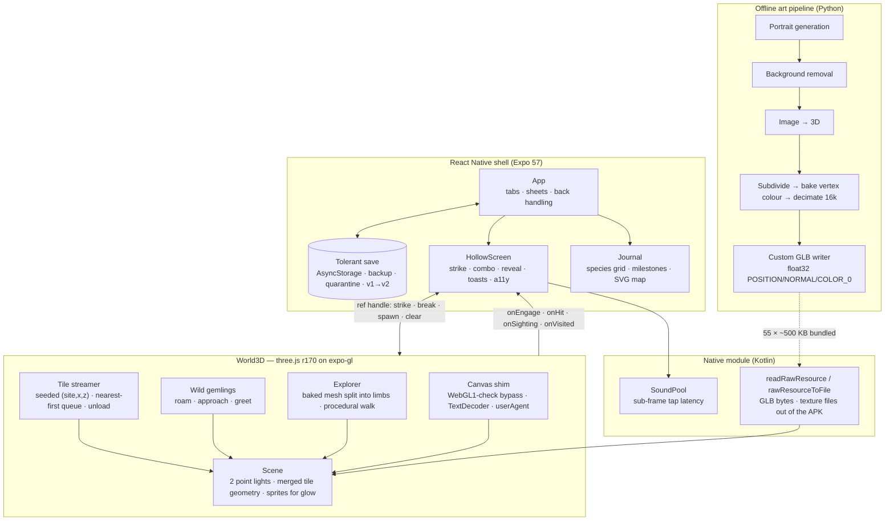

# Gemlings — an endless 3D exploration game on React Native

A shipped Android game: a real-time three.js world streamed inside a React
Native app, a generated-art pipeline that turned 55 creature portraits into
lightweight 3D models, and a game loop deliberately designed to be playable
by everyone and to never sell chance.

> **Status:** Shipped to a real device and being prepared for Google Play
> (closed testing). Package `com.markus864.gemlings`. The game's source is
> not in this repository; this is the engineering case study. Public site and
> privacy policy: <https://markus864.github.io/gemlings-site/>.

---

## TL;DR

I designed and built **Gemlings** — *every rock has someone inside* — a game
where you walk out from camp into a world that never ends, crack open the
stones you find, and wake the crystal creatures sleeping inside them. Six
sites with their own weather and light, 55 species, a hand-drawn expedition
map, a daily ritual, and a journal that fills in as you go.

The interesting engineering is not the creatures — it is everything that had
to be true for a **3D world to run at frame rate on a phone, inside React
Native, without a game engine**:

- **three.js on `expo-gl`**, driven through a ~30-line canvas shim, with the
  UI, accessibility layer, and save system all in ordinary React Native.
- An **endless streamed world**: 24-unit tiles generated deterministically
  from `(site, x, z)`, built nearest-first a few per frame so the walk never
  stalls, and unloaded behind you. The same place is there when you walk back.
- A **generated-art pipeline** (image → 3D → baked vertex colours → a custom
  GLB writer) that produced all 55 models at ~500 KB each with zero texture
  plumbing on the device.
- A **fixed-light-count rendering rule** that turned a stuttering walk into a
  steady one: exactly two point lights in the scene, ever; everything that
  glows is emissive plus a sprite.
- A **verification discipline**: nothing counts until it is seen on a release
  build — driven by emulator scripts on my side, and sideloaded to a real
  phone over a private network for play-testing.

---

## 1. Problem

I wanted a *Pokémon-feeling* exploration game — bright, hand-painted, an
adventure you explore and a guide you complete — that a single developer
could ship on Android, that a child with one thumb or a screen-reader user
could play, and that made money (eventually) without ever selling a random
outcome.

| Constraint | Why it was hard |
|---|---|
| **3D world, but a React Native app** | The UI, save, accessibility and store plumbing are far easier in RN than in a game engine — but RN has no 3D. Bridging three.js to `expo-gl` means fighting a renderer that assumes a browser. |
| **Endless, but stable** | A world that keeps building must never blank a frame, never leak, and must be the *same* world when you walk back to a place. |
| **Runs on a phone** | Naïve scenes (one light per glowing stone, one draw call per crystal) stuttered on every tile load. Mobile GPUs punish shader recompiles and draw-call counts. |
| **55 creatures of art** | Hand-modelling 55 rigged characters is out of reach for one person. Generated 3D is fast but arrives as 1.4 MB textured GLBs that render black in three without care. |
| **Playable by everyone** | A tap-to-crack loop must not become a chore for someone who cannot tap three times a second. Rarity must be readable without colour. |
| **Honest monetisation** | No loot boxes, no paid rerolls, no purchasable luck — and the codebase has to make that hard to violate later, not just intend it. |

---

## 2. Architecture



**The contract between UI and world is narrow on purpose.** `World3D` draws
the place and reports events (*reached a stone, a strike landed, a landmark
was found, a tile was entered*); `HollowScreen` owns the rules (damage,
combo, rarity, the reveal card) and never touches the save; `App` owns the
save. A half-cracked stone stays half-cracked while you read your journal,
because the world is never unmounted — the paper pages are laid over it.

---

## 3. Key Decisions & Trade-offs

### 3.1 three.js inside React Native, not a game engine

**Decision:** render the world with three.js on `expo-gl` inside the RN app,
rather than building in Unity/Godot and bolting on UI.

**Why:** everything *around* the world — the journal, the settings sheet,
screen-reader announcements, the tolerant save, the store plumbing — is
ordinary product engineering that RN does well. The world is one component.
One codebase, one build, one accessibility story.

**What it cost:** three.js assumes a browser. Three shims were needed, each
discovered the hard way: three ≥ r163 refuses any context that
`instanceof WebGLRenderingContext`, and expo-gl's WebGL2 context matches it —
the global has to be hidden for the constructor call; `GLTFLoader` sniffs
`navigator.userAgent`, which RN does not define; Hermes may lack
`TextDecoder`. And `fetch()` cannot read bundled Android resources, so GLB
bytes come out through a small native module. See
[ADR-0001](./docs/adr/0001-three-js-on-expo-gl.md).

### 3.2 A deterministic, streamed, endless world

**Decision:** the world is not a level. It is a function of `(site, tileX,
tileZ)` → tile, hashed into a seeded PRNG, built on demand around the
explorer and dropped behind them. Tile (0,0) is camp and never unloads.

**Why:** an endless world that is *the same place when you come back* costs
nothing to store and cannot be "finished". Landmarks, wild creatures, and
which stones glow all fall out of the seed; the only state saved is what the
player *did* (sightings logged, tiles walked, stones opened).

**The trap:** building 25 tiles in one tick blanked the first frame for ~10
seconds. The fix is a nearest-first queue drained a couple of tiles per
frame, with the tile under the explorer built immediately. Opened stones are
remembered by slot and regrow after a while, so the world heals itself. See
[ADR-0002](./docs/adr/0002-streamed-deterministic-world.md).

### 3.3 Exactly two lights, ever — the performance rule that mattered most

**Decision:** the scene contains exactly two point lights (the lantern and
the daily geode). Nothing in tile content may add a light. Glow is emissive
material plus an additive sprite. Per-tile crystals and stalactites are
merged into one mesh each, with vertex colours and emissive scaled per
vertex in a tiny shader patch.

**Why:** the walk stuttered on every tile load, and the cause was not draw
calls — it was that every glowing stone carried a `PointLight`, so the light
*count* changed as tiles streamed, and three recompiled every material each
time. Fixing the count fixed the stutter (emulator baseline went from ~27 to
~36 fps). This is the single rule every later contributor is told first.

### 3.4 Generated art, baked to vertex colours, through a custom exporter

**Decision:** creatures start as generated portraits, become 3D through an
image-to-3D model, then are **baked to vertex colours** (subdivide → sample
texture per vertex → decimate to 16k faces → resample colour) and written by
a custom GLB writer that emits float32 `POSITION / NORMAL / COLOR_0`.

**Why:** the raw image-to-3D output is a 1.4 MB textured GLB per species —
too heavy ×55, and texture loading on `expo-gl` is its own project. Vertex
colours need no textures at all. The custom writer exists because the
off-the-shelf exporter stored colours as normalised bytes with no normals and
the models rendered black in three; float attributes are the path three
never argues with.

**What it cost:** faces stop reading below ~15k vertices, so 16k was the
floor, giving ~500 KB per species and 27 MB for all 55 — acceptable for a
Play bundle without an asset pack. See
[ADR-0003](./docs/adr/0003-baked-vertex-colour-models.md).

### 3.5 A walk cycle without a rig

The explorer is a single baked mesh with no skeleton. Rather than rig it, the
mesh is **split by triangle at load time** — below the hips into a left and a
right leg, and the lantern side between hip and shoulder into an arm — each
hung on its own pivot and swung by the frame loop. Four draw calls instead
of one, no skinning, no extra lights. Every slice is sanity-checked and an
implausible one is folded back into the body, so a bad heuristic degrades
instead of shipping a mangled character.

### 3.6 Native where latency or file access demanded it

Two things could not be done in JS: **tap sound latency** (the media player
path lands 100–300 ms late on real phones, which made the tap click arrive
after the chisel) and **reading bundled binary assets**. A small Kotlin
module wraps Android's `SoundPool` for cues and exposes
`readRawResource` / `rawResourceToFile` so GLBs and textures come straight
out of the APK. A trap worth recording: the asset library moves an embedded
resource URI from `localUri` into `uri` and nulls the former, so code that
reads `localUri` silently never finds the file.

### 3.7 Sell known content, never chance — enforced in code, not policy

The stage table carries the rule at the top of the file: this game sells
*known content*. Rarity odds are identical in every site and published
in-app. There are no paid rerolls, no purchasable luck, no currency that
converts to random pulls. When rewarded ads were later designed, the same
rule applied: an ad may grant a cosmetic or a convenience, never anything
that touches the rarity roll. Making the rule a code comment beside the data
it governs is how it survives contributors who never read the design doc.

### 3.8 Playable by everyone, as a design constraint

Everything a player can do in the world can be done with two big labelled
buttons — *Walk to a stone* and *Strike* — so a screen reader, a switch, or
one thumb is enough. Rock integrity follows a **logarithmic, capped** curve
(a capped rock is ~15 gentle taps; *Easier strikes* halves that again).
Rarity is shown by glyph and by word, not only colour. Reduced motion follows
the OS setting from the first frame. Every reveal, sighting, and arrival is
announced.

---

## 4. Tech & Design Principles

- **Stack:** React Native 0.86 / Expo 57, three.js r170 on `expo-gl`, Hermes,
  a local Expo module in Kotlin, `react-native-svg` for the hand-drawn map.
- **Pipeline:** Python (numpy, PIL, scipy, trimesh, fast-simplification)
  driving hosted generation models over REST for portraits, backgrounds,
  tileable textures, ambient audio, and image-to-3D. Keys come from a
  credential store at runtime and are never in source.
- **Tolerant save.** Every write keeps the previous snapshot as a backup.
  Loading repairs a missing field, drops one damaged row, and never throws
  away the journal for a recoverable problem; anything unreadable is parked
  in a quarantine key rather than lost. The original app's four-key save is
  migrated once and the old keys removed so it can never shadow newer
  progress.
- **Narrow contracts.** World ↔ game is a ref handle plus a handful of
  callbacks. Generated tables (models, art, ambient loops) are emitted by the
  pipeline as literal `require()` maps because the bundler needs literal
  paths — so art and game data cannot drift apart.
- **Fail visibly in release.** Unhandled promise rejections are silent in a
  release build, so every async path `.catch`es and logs to a tagged
  channel that the verification drivers grep.
- **Perf rules are written down.** Two lights. Merge tile geometry. Build
  tiles from a queue. Glow is a sprite. Each has a story attached.

---

## 5. Verification discipline

Nothing is "done" until it is seen on the **release** build:

- **Emulator drivers** (Python over `adb`) wipe the save and run the
  tutorial, grind a site to completion, exercise settings and back handling,
  move the device clock to test the daily ritual, and upgrade from the old
  save format — capturing screenshots and the world's tagged log lines as
  evidence.
- **Pixel probes, not UI dumps.** The accessibility-tree dump hangs on a
  continuously animating app, so drivers read state from pixels. Lesson
  learned the hard way: probe coordinates must be in *pixels*, not
  density-independent units — a card styled `left: 12` dp starts at x=32 px,
  and a probe at x=20 read the world beside the card and reported "no card"
  for every reveal while the journal quietly filled up.
- **Real device.** Builds are sideloaded to a phone over a private mesh
  network from a small self-hosted download page carrying the version and
  SHA-256.

---

## 6. Outcomes

- **A shipped 3D game in React Native**, ~123 MB universal APK, 55 species,
  six sites, endless world — steady frame rate on a phone with the two-light
  rule in place.
- **27 MB of 3D models for 55 creatures**, all from a repeatable pipeline; a
  new species is one table row plus a pipeline run.
- **A save that has survived** a format migration, deliberate corruption, and
  backup restoration without losing a journal.
- **Store-ready:** signed upload key, reproducible signed bundle build,
  permissions audited in the merged manifest, listing copy, screenshots, and
  a published privacy policy.
- **A written body of gotchas** — the WebGL1 check, the black-model
  exporter, the light-count recompile, the dp-vs-px probe — that any later
  contributor reads before touching the world.

---

## 7. Repository Layout (reference)

```
gemlings/
├── README.md              # this case study
└── docs/adr/
    ├── 0001-three-js-on-expo-gl.md
    ├── 0002-streamed-deterministic-world.md
    └── 0003-baked-vertex-colour-models.md
```

The production app organises as `src/world/` (three.js scene, tile
streamer, wilds, explorer), `src/world/HollowScreen.tsx` (the game around
the world), `src/screens/` (journal, sites), `src/state/` (the save),
`src/game/` (species, sites, goals, rarity), `modules/gemlings-sfx/` (Kotlin),
`tools/art/` and `tools/mesh/` (the pipeline), and `tools/emu/` (drivers).

---

## 8. What I'd Build Next

- **Rewarded ads and a one-time remove-ads purchase**, designed so that no
  reward can touch the rarity roll (the rule in §3.7 is the spec).
- **Sky domes and sway** for the sunlit sites — a gradient sky, a sun sprite,
  drifting clouds, vertex-swayed foliage — all without a new light.
- **A real-phone perf pass** with bloom and shadow-map size adapting to
  device class.
- **Soft skinning for the explorer** in place of the triangle split, if the
  walk ever needs to read at closer camera distances.

---

*Authored by Markus864.*
