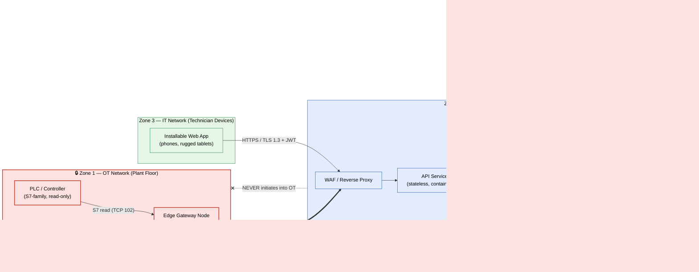

# Industrial IoT / IT–OT Convergence Platform

> A cloud-native maintenance-intelligence platform that bridges plant-floor
> operational technology (OT) to a modern IT application stack across a strict,
> one-way security boundary — with edge PLC/sensor ingestion, a retrieval-augmented
> AI troubleshooting assistant, full Terraform IaC, and a defence-in-depth security model.

**Role:** Sole architect and engineer — I designed and built this end to end across
edge, cloud, and frontend: the architecture, the infrastructure-as-code, the IT/OT
security model, and the edge-to-cloud data path.

**Status:** Designed and built by me, then validated end to end in a sandboxed test
environment against simulated PLC and document data. It has since been presented to a
manufacturing company and is awaiting their approval for a live on-site pilot — it is
not yet deployed at a plant or in use by technicians. All identifiers, endpoints, and
credentials in this repository are placeholders.

---

## 1. Problem

Maintenance teams on a manufacturing floor were losing hours per downtime event to
friction that had nothing to do with the actual repair:

- **Knowledge was trapped on paper and network shares.** Electrical drawings,
  mechanical manuals, and the history of past repairs lived in binders and a flat
  intranet file share. A technician standing at a stopped machine had no fast way to
  find the *right* document for *that* asset.
- **Documentation was a second job.** Corrective actions and root-cause analysis were
  hand-written after the fact, inconsistently, and re-keyed into a CMMS later — if at all.
- **Downtime was invisible.** There was no reliable, timestamped record of when a
  machine went down, who worked on it, and when it came back. Mean-time-to-repair (MTTR)
  could not be measured, so it could not be improved.
- **OT could not simply be "connected to the cloud."** The plant network runs PLCs and
  control systems where an inbound connection, a malformed packet, or a careless write is
  a safety and production risk. Any solution had to treat the OT network as sacred:
  **read-only, outbound-only, no exceptions.**

**The architectural challenge:** deliver a modern, AI-assisted, cloud-native experience to
technicians *without* violating the isolation guarantees that plant and OT-security teams
require — and do it in a way that is reproducible, auditable, and cheap to run in steady state.

---

## 2. Architecture

The platform is organised into three trust zones with a single, tightly controlled
crossing point between OT and everything else.



**The load-bearing idea** is the **edge gateway node**: it is the *only* device that touches
both the OT network and the outside world. The edge connector performs read-only polling by
design — it pulls from the PLC and the document share, buffers locally, and pushes outbound over
mutual TLS. The platform is designed so it has no path to reach back in. This single constraint
shapes every other decision in the system.

The technician workflow is designed to run entirely through Zone 2 and Zone 3:

1. A work order is created in the CMMS and surfaced to the technician.
2. The technician scans a QR code on the machine; the installable web app opens to that asset.
3. A short-lived, role-scoped session token is issued and the sign-on time is stamped on the work order.
4. The app renders the asset's document tree (electrical, mechanical, manuals, past work orders).
5. The technician asks the AI assistant a troubleshooting question.
6. The assistant retrieves relevant document chunks (vector search), inventory, and repair
   history, then answers **with citations** back to the source documents.
7. The technician records the corrective action; a worker refines it and writes it back to the CMMS.
8. The technician scans out; downtime is computed automatically.
9. If downtime crosses a threshold, a background worker generates a structured root-cause
   ("5 Whys") report and writes it to the CMMS.

A deeper component and data-flow treatment lives in
[`docs/architecture.md`](docs/architecture.md).

---

## 3. Key Decisions & Trade-offs

These are captured as full Architecture Decision Records under
[`docs/adr/`](docs/adr/). The headlines:

| # | Decision | Why | Trade-off accepted |
|---|----------|-----|--------------------|
| [001](docs/adr/0001-on-prem-vs-cloud-deployment.md) | **Develop in the cloud, run production on-prem** (identical container stack) | Cloud gives fast, disposable, reproducible dev infra; on-prem is designed to keep proprietary plant data inside the building and to reduce recurring cloud spend in steady state | Operating two environments; on-prem ops burden (backup, patching, certs) falls on the engineer |
| [002](docs/adr/0002-one-way-ot-it-bridge.md) | **One-way OT→IT edge bridge** (outbound mTLS only, read-only protocols) | OT isolation is a hard requirement; a poll-and-push gateway is far easier to reason about and audit than any bidirectional integration | No remote control of OT from the platform — by design; near-real-time, not hard-real-time |
| [003](docs/adr/0003-vector-store-choice.md) | **Vector search co-located in the primary relational database** | One datastore to back up, secure, and operate; transactional consistency between documents and their embeddings; no extra network hop | Lower ceiling than a dedicated vector engine at very large scale — acceptable for plant-scale corpora |
| [004](docs/adr/0004-secret-manager-bootstrap.md) | **Cloud-managed secret store in the cloud env; sealed local secrets on-prem; no secrets in git, ever** | Removes the "first secret" bootstrap problem; identity-based access in the cloud, least-privilege on-prem; CI fails closed on any committed credential | Two secret backends to document and run; on-prem rotation is a manual runbook step |

Cross-cutting principles that drove the design:

- **Security as the primary constraint, not a layer added later.** The read-only,
  outbound-only OT boundary is an *architectural* rule, enforced by network segmentation and
  protocol choice, not just policy text.
- **Reproducibility over snowflakes.** The entire cloud environment is Terraform; the
  application stack is the *same* container set in both environments. Production cutover is
  "pull the images, supply the config, run the migrations."
- **Cost-awareness in steady state.** Heavy lifting happens in the cloud during build-out;
  the long-run footprint is on-prem hardware the business already owns, with the cloud env
  downsized to a minimal instance.
- **Provider-agnostic AI.** The troubleshooting assistant talks to a managed LLM inference
  API through a thin abstraction, so the model vendor is a configuration choice, not a
  rewrite. See [ADR-003](docs/adr/0003-vector-store-choice.md) and the architecture doc.

---

## 4. Technology

| Layer | Choice | Notes |
|-------|--------|-------|
| **Edge ingestion** | PLC poller over the S7 protocol (read-only), document sync over SMB | Connect → read a single data block → disconnect; no persistent OT session, no write functions linked |
| **Edge transport** | Mutual TLS, outbound 443 only | Client certificate pinned to the gateway; platform never dials in |
| **API** | Python + async web framework, stateless containers | Horizontally scalable; health-checked behind the proxy |
| **Async work** | Task queue + broker | Document indexing, CMMS write-back, root-cause generation run off the request path |
| **Data store** | Managed relational database **with a vector extension** | Documents, embeddings, events, and immutable audit logs in one transactional store |
| **Object storage** | Cloud bucket (dev) / mounted volume (prod) | Source PDFs and drawings |
| **AI assistant** | Retrieval-augmented generation against a provider-agnostic managed LLM API | Answers cite the source documents; egress allow-listed |
| **Frontend** | Installable progressive web app | Runs on technician phones and rugged tablets; QR entry point |
| **IaC** | **Terraform** (modular: networking, compute, database, storage, secrets, WAF) | Remote state, environment-scoped configs |
| **CI/CD** | Pipeline with dependency scan, **secret scan (fail-closed)**, static analysis, and a **dynamic API security scan as a deploy gate** | No deploy if the security scan fails |
| **Secrets** | Cloud-managed secret store (cloud) / sealed local file with restricted permissions (on-prem) | Injected at runtime via workload identity / least-privilege access |

The Terraform layout and the security model are the two areas I'd point a reviewer to first:

- **IaC** — [`docs/architecture.md` § Infrastructure as Code](docs/architecture.md#infrastructure-as-code)
- **Security** — [`docs/architecture.md` § Security Model](docs/architecture.md#security-model)

---

## 5. What It Delivers & Validation Status

What the architecture is designed to deliver, and what I have verified so far:

- **A strong, auditable OT boundary.** Plant-floor systems are reachable only by a single
  hardened gateway, designed for one-way OT→IT isolation: the edge connector performs read-only
  polling by design, and the firewall posture permits outbound traffic only. The intent is that
  there is no network path from the platform into OT — a property meant to be checkable from the
  firewall rules and protocol choices rather than taken on trust.
- **Maintenance knowledge at the machine.** The design puts the right drawings, manuals, and
  repair history one QR-code scan away, so a technician would not have to walk back to a binder
  or a shared drive.
- **Documentation that writes itself.** The workflow is built so that corrective actions are
  refined and pushed to the CMMS automatically, and qualifying downtime events generate a
  structured root-cause report without anyone re-keying it.
- **Measurable downtime.** Because every event carries timestamped sign-on/sign-off and
  asset/technician attribution, the design makes MTTR a metric the platform can compute rather
  than a guess.
- **Reproducible, low-drift infrastructure.** The cloud environment stands up from Terraform,
  and the same container stack is intended to run in the on-prem production environment.
  Rebuilding the environment or cutting over is a documented, repeatable procedure rather than
  tribal knowledge.
- **Security baked into delivery.** Every change runs through dependency, secret, static, and
  dynamic security scans, with the dynamic API scan gating deployment.

**Validation status.** I have exercised the full path end to end in a sandboxed test
environment against simulated PLC and document data — edge ingestion, the one-way bridge, the
API and data store, retrieval-grounded troubleshooting, and the Terraform-defined
infrastructure. The platform has been presented to a manufacturing company and is awaiting
their approval for a live on-site pilot. It has not yet been deployed at a plant or used by
technicians, so the operational benefits above are design goals validated in a test
environment, not measured production results.

---

## 6. Repository Map

```
.
├── README.md                  # This case study
└── docs/
    ├── architecture.md        # Component map, data flow, IaC, security model (with diagrams)
    └── adr/
        ├── 0001-on-prem-vs-cloud-deployment.md
        ├── 0002-one-way-ot-it-bridge.md
        ├── 0003-vector-store-choice.md
        └── 0004-secret-manager-bootstrap.md
```

---

## 7. Notes on This Write-up

This is a genericised reference architecture distilled from a real industrial IT/OT
convergence build. Asset names, network addresses, project identifiers, the specific CMMS
product, and the AI provider have been replaced with placeholders and provider-agnostic
descriptions so the design can be reused by any team. Where a credential would appear, the
text shows an **environment-variable name** (for example `LLM_API_KEY`, `JWT_SECRET_KEY`,
`DATABASE_URL`) rather than a value.
