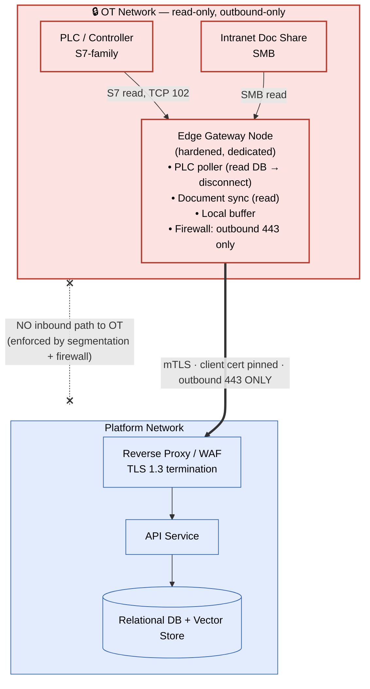

# Architecture

This document covers the system context, the OT/IT security boundary, the end-to-end data
flow, the infrastructure-as-code layout, and the security model. Architecture Decision
Records for the four most consequential choices live in [`adr/`](adr/).

All hostnames, addresses, identifiers, and credentials below are placeholders or
environment-variable names. Nothing here is a real endpoint or secret.

---

## System Context

The platform spans three trust zones:

1. **Zone 1 — OT network (plant floor):** PLCs / controllers and an intranet document share.
   Treated as read-only and outbound-only. Nothing on the platform may initiate a connection
   into this zone.
2. **Zone 2 — Platform:** the containerised application stack (reverse proxy / WAF, API,
   async workers, relational + vector datastore, object storage). Runs in the cloud during
   development and is designed to run on an on-premises server in the production environment —
   the *same* container set in both.
3. **Zone 3 — IT network (technician devices):** phones and rugged tablets running an
   installable progressive web app, on the plant Wi-Fi / intranet.

Two external systems sit outside all three zones and are reached only as allow-listed
outbound HTTPS dependencies: a **CMMS / work-order system** and a **managed LLM inference API**.

---

## Security Boundary — OT Isolation

The entire design hinges on a single rule: **the platform is built so it never initiates a
connection into the OT network.** Data leaves OT only by being *pulled* by the edge gateway and
*pushed* outbound. The edge gateway is the only device with a foot in both worlds.



**Why this is intended to be safe by construction:**

- The edge connector performs **read-only polling by design**. It connects, reads a single data
  block, and disconnects — no persistent OT session — and the poller links in no write-capable
  functions, so it has no code path to write to a controller.
- Only **read-oriented protocols** are used toward OT (S7 read, SMB read). No OPC-UA writes,
  no control protocols.
- The gateway's host firewall is configured to **block all inbound** and permit **outbound 443
  only**, to the platform endpoint.
- Network segmentation is designed to give the gateway the *only* route between the OT VLAN and
  anything outbound, with no route from the platform side back into the OT VLAN.

### Data-flow rules at the boundary

| Direction | Protocol | Allowed? | Notes |
|-----------|----------|----------|-------|
| OT → Edge | S7 read (TCP 102) | ✅ read-only | Fault/sensor data blocks only |
| OT → Edge | SMB read | ✅ read-only | Source documents only |
| Edge → Platform | mTLS / HTTPS 443 | ✅ outbound only | Buffered events + document payloads |
| Platform → OT | any | ❌ **never** | Hard architectural rule |
| Device → Platform | HTTPS / TLS 1.3 | ✅ authenticated | Short-lived session token required |
| Platform → CMMS | HTTPS | ✅ egress | Work-order read/write |
| Platform → LLM API | HTTPS | ✅ egress, allow-listed | Troubleshooting inference |

---

## End-to-End Data Flow — Technician Repair Workflow

```mermaid
sequenceDiagram
    autonumber
    participant CMMS as CMMS / Work Orders
    participant Tech as Technician (PWA)
    participant API as API Service
    participant DB as DB + Vector Store
    participant W as Async Worker
    participant LLM as Managed LLM API

    CMMS->>API: Work order created (sync)
    Tech->>API: Scan asset QR → open work order
    API->>API: Issue short-lived, role-scoped token
    API->>DB: Stamp sign-on time on work order
    API-->>Tech: Asset document tree (drawings, manuals, history)

    Tech->>API: Troubleshooting question
    API->>DB: Vector search over asset documents
    API->>CMMS: Inventory + past work-order lookup
    API->>LLM: Prompt + retrieved context (RAG)
    LLM-->>API: Answer
    API-->>Tech: Answer WITH citations to source docs

    Tech->>API: Record corrective action
    API->>W: Enqueue refine + write-back
    W->>LLM: Refine corrective-action text
    W->>CMMS: Write polished corrective action

    Tech->>API: Scan QR → sign off
    API->>DB: Stamp sign-off; compute downtime
    alt downtime over threshold
        API->>W: Enqueue root-cause ("5 Whys") generation
        W->>LLM: Generate structured RCA
        W->>CMMS: Write RCA report
    end
```

Key properties of this flow:

- **Grounded answers.** The assistant only answers from retrieved, asset-specific context and
  returns citations, so a technician can verify the source. This is retrieval-augmented
  generation, not free-form generation.
- **Everything slow is asynchronous.** Document indexing, CMMS write-back, and root-cause
  generation run on workers, off the request path, so the technician-facing app stays responsive.
- **Every step is attributable.** Sign-on, sign-off, document access, and each assistant
  session are recorded with timestamps and the acting user, producing an audit trail and the
  data needed to measure MTTR.

---

## Logical Data Model

A compact relational schema backs the workflow. Documents and their embeddings live in the
same store (see [ADR-003](adr/0003-vector-store-choice.md)).

| Entity | Purpose |
|--------|---------|
| `users` | Technicians, supervisors, admins — each with an RBAC role |
| `assets` | Plant machines, keyed to the CMMS asset identifier |
| `work_orders` | Work orders synced from the CMMS, with sign-on/sign-off timestamps |
| `documents` | Indexed PDFs/drawings from the document share (with vector embeddings) |
| `events` | Fault/sensor events received from the edge poller |
| `assistant_sessions` | Full troubleshooting transcripts with citations |
| `rca_reports` | Auto-generated root-cause ("5 Whys") reports |
| `access_logs` | Immutable audit trail of document access and auth events |

---

## Infrastructure as Code

The cloud environment is defined entirely in **Terraform**, split into reusable modules and
environment-scoped configurations. State is stored remotely with versioning enabled.

```
infrastructure/terraform/
├── modules/
│   ├── networking/    # VPC, subnet, firewall rules, Cloud NAT, private service access
│   ├── compute/       # Hardened VM: shielded boot, no public IP, scoped service account
│   ├── database/      # Managed Postgres (private IP), automated backups, PITR
│   ├── storage/       # Object bucket for documents, IAM-scoped
│   └── secrets/       # Managed secret store entries + least-privilege IAM bindings
└── environments/
    ├── dev/           # Cloud development/test environment
    └── prod/          # Minimal footprint (production app runs on-prem)
```

**Design choices in the IaC worth calling out:**

- **No public ingress by default.** The networking module creates an explicit
  **deny-all-ingress** rule at low priority and only opens the ports the proxy needs. The VM
  has **no external IP**; administrative access is via an identity-aware tunnel restricted to
  the platform's documented tunnel source range — there is no SSH exposed to the internet.
- **Private database.** The managed Postgres instance has **public IP disabled** and is
  reachable only over a private VPC peering connection. Automated backups and
  point-in-time-recovery are on.
- **Hardened compute.** The VM enables shielded-instance features (secure boot, vTPM,
  integrity monitoring) and runs under a **dedicated, narrowly-scoped service account** rather
  than a default identity.
- **Least-privilege secret access.** Each secret is an individual managed-secret resource, and
  the VM's service account is granted accessor rights **per secret** — not blanket project access.
- **Egress, not ingress, for the internet path.** Outbound calls (to the LLM API, the CMMS)
  leave through Cloud NAT; nothing inbound is required for them.

A representative Terraform snippet for the boundary posture (placeholders only):

```hcl
# Deny-all ingress baseline — nothing is reachable unless explicitly allowed above it.
resource "google_compute_firewall" "deny_all_ingress" {
  name     = "${var.name_prefix}-deny-ingress"
  network  = google_compute_network.main.name
  priority = 65534

  deny { protocol = "all" }
  source_ranges = ["0.0.0.0/0"]
}

# Admin access only through the identity-aware proxy tunnel range — never open SSH publicly.
resource "google_compute_firewall" "allow_ssh_via_iap" {
  name          = "${var.name_prefix}-allow-ssh-iap"
  network       = google_compute_network.main.name
  allow { protocol = "tcp", ports = ["22"] }
  source_ranges = [var.iap_tunnel_cidr] # documented proxy range, not the open internet
  target_tags   = ["${var.name_prefix}-app"]
}

# Application VM: no external IP, shielded, scoped service account.
resource "google_compute_instance" "app" {
  name         = "${var.name_prefix}-app"
  machine_type = var.machine_type

  network_interface {
    subnetwork = var.subnetwork
    # (no access_config block → no public IP)
  }

  service_account {
    email  = google_service_account.app.email
    scopes = ["cloud-platform"]
  }

  shielded_instance_config {
    enable_secure_boot          = true
    enable_vtpm                 = true
    enable_integrity_monitoring = true
  }
}
```

---

## Security Model

Security is treated as the platform's primary constraint. The controls layer from the network
inward.

### Boundary & transport
- **OT isolation** as described above — the defining control.
- **mTLS** on the edge→platform tunnel, with the client certificate pinned to the gateway.
- **TLS 1.3** on all device/API traffic; older TLS versions disabled; HTTP redirects to HTTPS.

### Identity & access
- **Short-lived, role-scoped session tokens** for technicians, issued at QR sign-on and
  invalidated at sign-off. Tokens are scoped to the active work order's asset.
- **Role-based access control** (technician / supervisor / admin / read-only) enforced at the
  API layer.
- **MFA** required for elevated (admin, supervisor) roles.
- **Edge services authenticate with their own keys**, stored in the OS credential vault on the
  gateway — never in plaintext config.

### Application
- A **WAF** in front of the API (managed rules in the cloud env; reverse-proxy + rule-set
  on-prem) covering injection, XSS, RCE, and path-traversal classes, plus rate-limiting on the
  auth endpoint.
- **Input validation** on every request via typed schemas; the ORM uses parameterised queries
  exclusively (no string-built SQL).
- **Security headers** (HSTS, `X-Content-Type-Options`, `X-Frame-Options`, a restrictive CSP,
  and a strict referrer policy) set at the proxy.
- **Tight egress**: the platform reaches only allow-listed external endpoints (the LLM API and
  the CMMS); no user-controlled outbound URLs.

### Secrets
- **No secret is ever committed.** A secret-scanning step in CI fails the build on any detected
  credential. See [ADR-004](adr/0004-secret-manager-bootstrap.md).
- **Cloud env:** a managed secret store, with the compute identity granted accessor rights per
  secret.
- **On-prem:** a sealed local secrets file with restricted file permissions, readable only by
  the service account; edge keys in the OS credential vault.
- Code and docs reference **environment-variable names only** (e.g. `LLM_API_KEY`,
  `JWT_SECRET_KEY`, `DATABASE_URL`, `CMMS_API_KEY`, `EDGE_API_KEY`).

### Delivery pipeline (security gates)
Every change to the main branch runs:

1. **Dependency vulnerability scan** (language package audits).
2. **Secret scan** — fail-closed.
3. **Static analysis** (lint + type checks).
4. **Dynamic API security scan** against a running instance of the API.
5. **Container build** with a non-root runtime user.

**The dynamic API security scan is a deploy gate** — if it fails, the deploy workflow does not run.

### Data classification & audit
- Troubleshooting transcripts and root-cause reports are treated as confidential and retained
  per policy; document-access and auth events are kept as an immutable audit trail.
- Token values, keys, and document contents are **never** written to logs.
- In the production topology, the design keeps **proprietary plant data inside the building** —
  the application is intended to run on-prem, with the only external calls going to the
  allow-listed CMMS and LLM endpoints.

### Incident response (boundary-aware)
- A suspected OT-side event triggers **physical disconnection of the edge gateway** first,
  then log preservation, then analysis before reconnection.
- A platform compromise triggers token revocation (rotate the signing key), rotation of all
  external API keys, and an audit-log review to scope impact.

---

## Provider-Agnostic AI Layer

The troubleshooting assistant talks to a **managed LLM inference API through a thin internal
abstraction**. The concrete provider and model are supplied by configuration
(`LLM_API_KEY`, `LLM_MODEL`), so swapping vendors is a config change, not a re-architecture.
Retrieval (vector search over the document store), citation assembly, and prompt construction
live in the platform; only the final inference call crosses the boundary to the provider, over
allow-listed egress. This keeps the design portable and avoids coupling the maintenance logic
to any single AI vendor.

---

## Related Decision Records

- [ADR-001 — On-prem vs cloud deployment](adr/0001-on-prem-vs-cloud-deployment.md)
- [ADR-002 — One-way OT→IT bridge](adr/0002-one-way-ot-it-bridge.md)
- [ADR-003 — Vector store choice](adr/0003-vector-store-choice.md)
- [ADR-004 — Secret-manager bootstrap](adr/0004-secret-manager-bootstrap.md)
