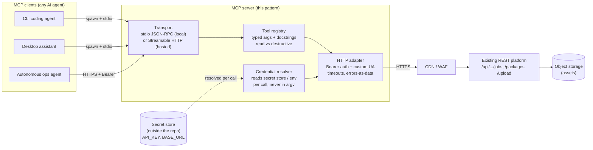

# MCP Integration Pattern — Exposing a REST Platform to AI Agents as Typed Tools

A design pattern and case study for putting a clean **Model Context Protocol (MCP)** server in front of an existing REST platform, so that any MCP-capable AI agent can drive the platform through typed, self-describing tools instead of hand-rolling a bespoke HTTP client per agent.

> **Author / engineer:** Mark Splawn
> **Type:** Solutions-architecture case study + design pattern
> **Status:** The pattern is language-agnostic and is implemented and running in production against a live content-generation platform. This repository documents the design (case study + ADRs); it does not contain the server source. All identifiers, hosts, and credentials shown here are placeholders.

---

## TL;DR

I had a working SaaS platform with a perfectly good REST API, and a growing number of AI agents that all wanted to call it. Rather than write — and re-write — a custom integration inside every agent, the pattern is a single thin **MCP server** that adapts the REST surface to the Model Context Protocol once. Every MCP-capable agent gets the same set of typed tools, the same credential handling, and the same safety guarantees from one place, rather than per-agent glue. The pattern is language-agnostic; my implementation of it runs in production against a live content-generation platform.

The design centres on three decisions: **MCP as the integration contract**, **credentials externalized out of the repository and out of process arguments**, and a **read-vs-destructive tool classification** that lets agents reason about side effects and cost before they act.

---

## Problem

The starting point was a content/asset-generation platform exposed over a conventional REST API (`POST /api/.../jobs`, `GET /api/.../jobs`, etc.). Several different AI agents — a CLI coding agent, a desktop assistant, an autonomous operations agent — all needed to:

- list and inspect work that the platform had queued,
- create new generation jobs (which **cost money** per call),
- upload assets and chain multi-step workflows.

The naive approach was already showing its costs:

| Pain point | Why it hurt |
|---|---|
| **N integrations for N agents** | Each agent re-implemented auth, base-URL handling, retries, and error parsing against the same API. Bug fixes had to be ported by hand to every copy. |
| **No shared notion of "this is dangerous"** | Generation calls bill credits. Each agent had to *independently remember* which endpoints were safe to call speculatively and which were not. Nothing in the API made that distinction machine-readable. |
| **Credentials sprayed across clients** | The API key ended up pasted into multiple client configs, environment blocks, and — worst case — process command lines, which are visible to anyone who can list processes. |
| **Weak typing at the boundary** | Agents were constructing raw JSON bodies. A wrong field name surfaced only as a runtime 400 from the server, not as a typed-argument error the agent could correct. |
| **Edge/WAF friction** | The platform sits behind a CDN/WAF that rejected default HTTP client fingerprints, so *every* integration had to rediscover the same workaround. |

The underlying issue is that **REST is a great contract for humans and code, but a poor contract for autonomous agents.** An agent benefits from a tool catalog it can introspect, typed parameters it can fill correctly, and metadata about consequences. That is exactly what MCP standardizes.

---

## Architecture

The pattern is a single MCP server process that sits between MCP clients and the existing platform API. It owns three things the agents would otherwise each own: **the protocol adaptation, the credentials, and the safety policy.**



### How a request flows

1. An MCP client connects to the server — either by **spawning it over stdio** (local, single-user) or by calling a **hosted HTTP endpoint** with a Bearer token (multi-client).
2. The client discovers the tool catalog via MCP introspection. Each tool advertises typed parameters, a human/agent-readable description, and whether it is read-only or destructive.
3. When a tool is invoked, the **credential resolver** fetches the API key fresh from the external secret store (or the per-request Authorization header in the hosted case).
4. The **HTTP adapter** calls the existing REST endpoint with Bearer auth and a CDN/WAF-compatible User-Agent, under a request timeout.
5. Failures (HTTP 4xx/5xx, parse errors) are returned to the agent **as structured data**, not raised as exceptions, so the agent can branch on them.

### What the server deliberately does *not* do

- It is **not** a second copy of the platform's business logic. Authorization, billing, and job execution stay server-side in the platform. The MCP server is a thin, honest adapter.
- It does **not** cache credentials in memory for the life of the process — see [ADR-0002](docs/adr/0002-externalized-config.md).
- In its simplest (stdio) form it is **not** a multi-tenant service. That is a property of the transport, and the hosted HTTP form addresses it — see [ADR-0003](docs/adr/0003-transport-choice.md).

---

## Key Decisions & Trade-offs

The architecture is the sum of a few deliberate calls. Each is captured as a short ADR; the highlights:

### 1. MCP as the single integration contract — [ADR-0001](docs/adr/0001-why-mcp.md)
Instead of an SDK or per-agent HTTP client, expose the platform once as MCP tools. **Benefit:** one integration can serve any MCP-capable agent; tools are introspectable and typed. **Trade-off:** an extra process and protocol in the path, and a dependency on the MCP ecosystem's maturity.

### 2. Externalized configuration & credential isolation — [ADR-0002](docs/adr/0002-externalized-config.md)
The API key and base URL live in an OS-protected secret store **outside** the repository, resolved per call — never baked into the image, committed, or passed on the command line. **Benefit:** zero secrets in version control, key rotation with no restart, no leakage via process listings. **Trade-off:** a tiny per-call read, and an operational dependency on provisioning that store correctly.

### 3. Transport choice: stdio first, HTTP when needed — [ADR-0003](docs/adr/0003-transport-choice.md)
Default to **stdio** (the client spawns the server as a child process); offer **Streamable HTTP** for shared, hosted, multi-client use. **Benefit:** stdio has no network attack surface and trivial lifecycle; HTTP scales to many clients and central hosting. **Trade-off:** stdio is one-client-per-process; HTTP reintroduces network surface, auth, and CORS that must be handled correctly.

### 4. Read-vs-destructive tool classification
Every tool is tagged as a **free read** or a **destructive** (state-changing / cost-incurring) operation, in both the machine-readable tool description and the server's top-level instructions. It is a low-cost, high-leverage safety convention: it gives a well-behaved agent the signal it needs to *confirm intent before spending money or mutating state*, without the platform having to change.

```
Read (safe to call speculatively)        Destructive (confirm intent first)
─────────────────────────────────       ──────────────────────────────────
list_packages                            create_package        (costs credits)
get_package                              create_image_job      (costs credits)
list_jobs                                create_video_job      (costs credits)
upload_frame  (idempotent staging)
list_local_stock
```

---

## Reliability, Security, Scalability, Cost

Framing the same design through the non-functional lenses an SA is judged on:

- **Reliability.** Every outbound call has an explicit timeout, and the adapter returns errors as data so a transient platform failure degrades into a structured result the agent can retry or report — not an unhandled exception that kills the tool call. The server holds no durable state; job state is owned by the platform, so a crash or restart loses nothing.
- **Security.** No secrets in the repo or in process arguments; the API key is read from an OS-permission-protected store at the moment of use and never logged or echoed back in tool output. The stdio transport exposes **no listening socket at all**. The destructive-tool classification reduces the blast radius of an over-eager agent. (Full notes: [SECURITY.md](SECURITY.md).)
- **Scalability.** The stdio form scales *per user/agent* (one process each), which is correct for local single-operator use. When fan-out demands it, the **same tool code** is mounted under a stateless Streamable-HTTP transport behind a tunnel/load-balancer, so horizontal scaling is a transport concern, not a rewrite.
- **Cost.** Cost control is built into the contract, not bolted on: destructive (billable) tools are explicitly flagged so agents avoid speculative spend, and the server itself is a near-zero-cost process (no database, no always-on infra in the local form).

---

## Tech

| Layer | Choice (in the production implementation) | Why |
|---|---|---|
| Protocol | Model Context Protocol (JSON-RPC tool calls) | Standard, introspectable agent ↔ tool contract |
| Server | Any MCP server library (the pattern is language-agnostic; the production implementation uses one such stack) | Decouples the pattern from any single language or framework |
| Transport | stdio (local) and Streamable HTTP (hosted) | Match topology to use case |
| Backend call | Standard HTTPS client, Bearer auth, custom User-Agent | Reuse the platform's existing REST API untouched |
| Config | External secret store (file/KV) + env-var override | Secrets out of the repo and out of argv |
| Errors | Structured error objects (`{_http_error, _body}`) | Let agents reason about failures |

This repository documents the pattern (case study, setup guide, and ADRs); the server source lives with the production implementation, not here:

```
mcp-integration-pattern/
├── README.md                      # this case study
├── SETUP.md                       # generic, env-var-placeholder setup
├── SECURITY.md                    # threat model + secret handling
└── docs/
    └── adr/
        ├── 0001-why-mcp.md
        ├── 0002-externalized-config.md
        └── 0003-transport-choice.md
```

---

## Design benefits

What the pattern is built to deliver, drawn from the production implementation it documents:

- **One typed surface over the REST backend.** Adding an MCP-capable agent means pointing it at the existing server rather than writing and debugging a fresh REST client per agent; auth, retries, and error handling live in one place instead of being copied around.
- **Secrets stay out of the codebase.** The API key lives in an external, OS-protected store rather than the repository; this repo is verifiably secret-free and safe to publish.
- **Explicit read-vs-destructive classification.** Every tool carries a machine-readable signal for whether it is a free read or a state-changing / cost-incurring call, giving a well-behaved agent the chance to confirm intent before mutating state or incurring billable calls.
- **Backend stays untouched.** Because the server is a thin adapter, the platform's API, auth, and billing need no changes to gain agent support — and the same tool definitions can run under both a local and a hosted transport.

---

## Reusing this pattern

The pattern is not tied to any one platform. To adapt it to another REST backend:

1. Enumerate the endpoints agents need and group them into **read** vs **destructive** tools.
2. Define one typed MCP tool per operation; put the consequence (cost / mutation) in the description.
3. Resolve credentials from an **external** store keyed by env-var (see [SETUP.md](SETUP.md)).
4. Start with **stdio**; graduate to **Streamable HTTP** only when you need shared, hosted access.
5. Return upstream failures **as data**, with timeouts on every call.

See [SETUP.md](SETUP.md) for a copy-paste, placeholder-only quickstart.
