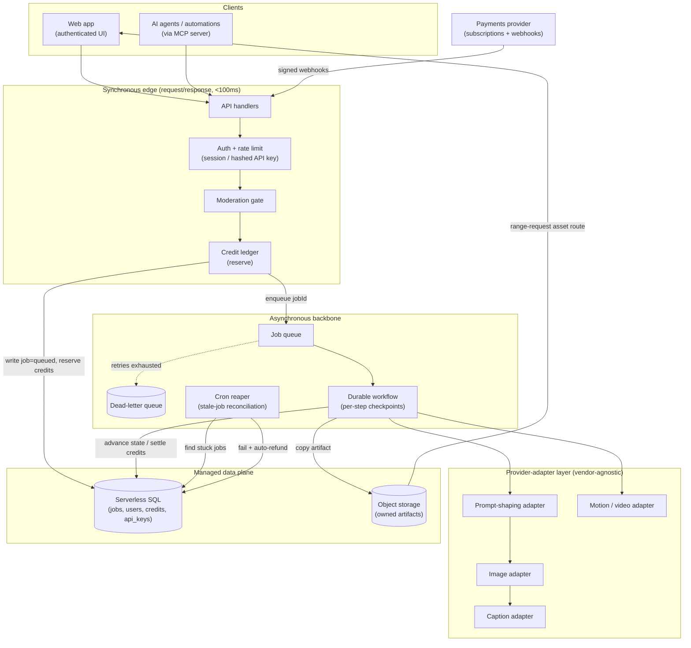
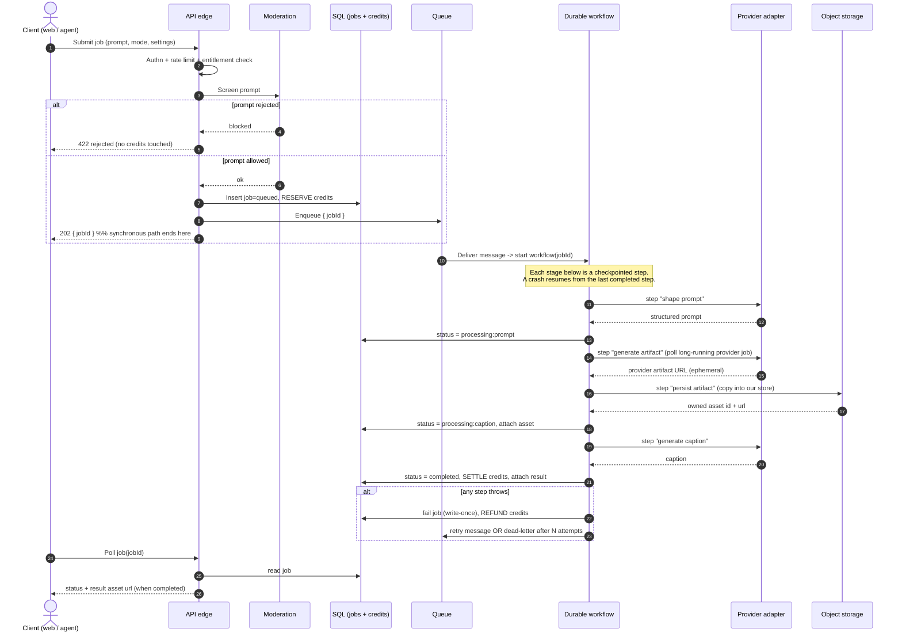
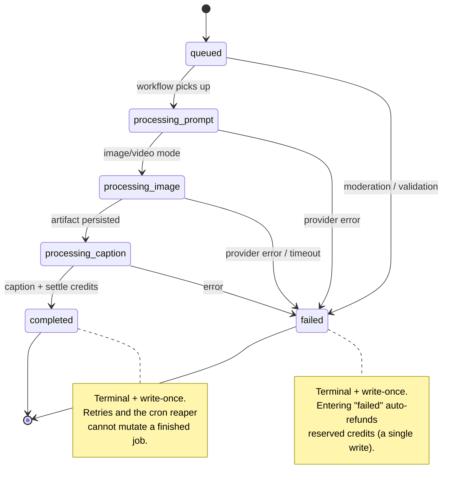
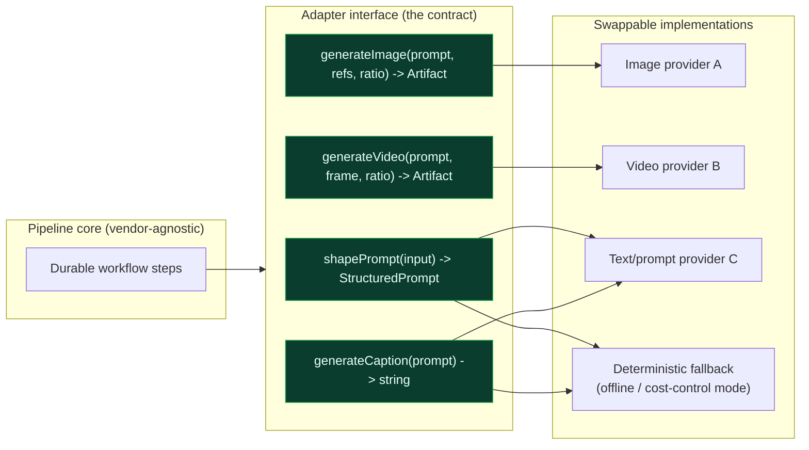
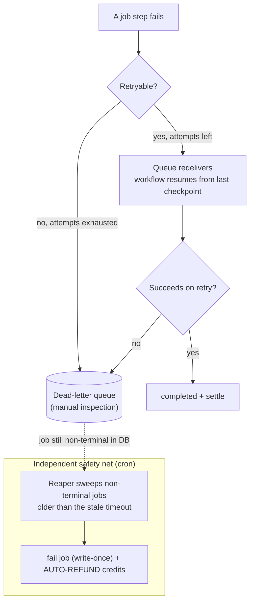
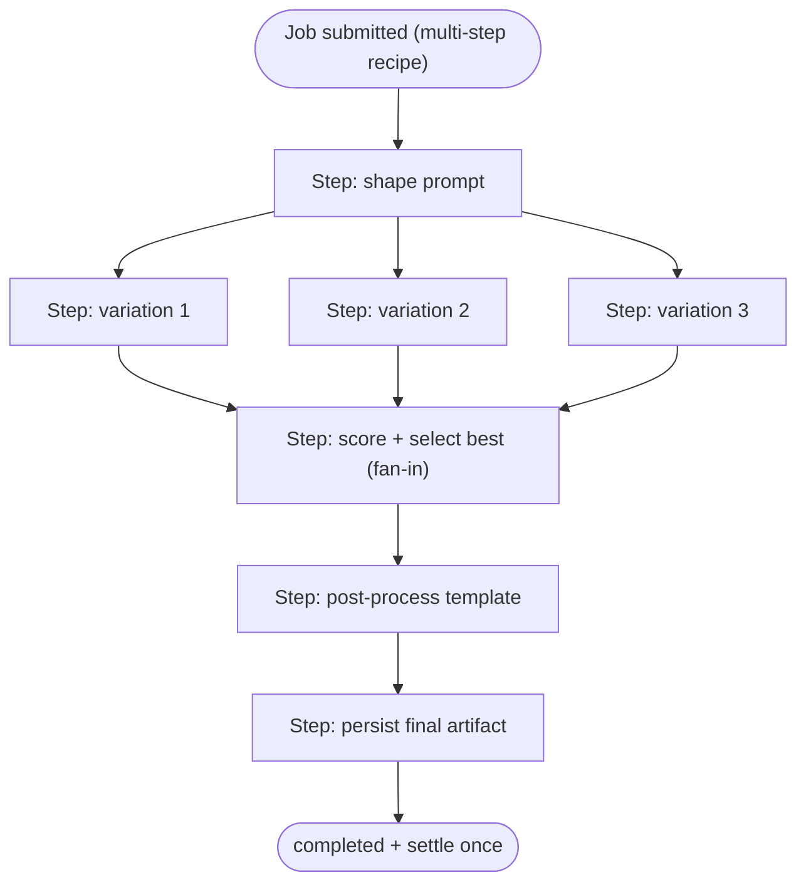

# Architecture

This document covers the **system topology**, the **asynchronous job pipeline** (the heart
of the platform), the **provider-adapter layer**, the **state machine** every job moves
through, and the **failure/reconciliation model**.

The guiding constraint: the runtime can terminate any execution at any time, third-party AI
providers are slow and unreliable, and every job is billed. Every design choice below exists
to make that environment safe.

---

## 1. System Topology

A clean split between the **fast synchronous edge** (accept, validate, enqueue, return) and
the **slow asynchronous worker** (durable, retryable, checkpointed background work). They
communicate only through a queue and shared state — never a held-open connection.



**Why this shape:** the edge returns a `jobId` in milliseconds and never blocks on a
provider. All slow, expensive, failure-prone work lives behind the queue where it can be
retried, checkpointed, and reconciled independently of any client connection.

---

## 2. The Asynchronous Job Pipeline (sequence)

This is the core flow: **request → moderation → reserve → queue → durable workflow →
provider → object storage → settle → result.** Note where the synchronous response is
returned (early) versus where the money is actually spent (late, and only after moderation).



### Why reserve-then-settle, and why moderation is first

- **Moderation runs before any spend.** No paid provider call is made for content that
  policy will reject — this protects both safety and unit economics.
- **Credits are *reserved* on submission and *settled* only on success.** A failure refunds
  the reservation. This is what the per-job billing relies on under retries: the design aims to
  charge the customer for outcomes, not attempts.

---

## 3. Job State Machine

Every job is a small, explicit state machine. Fine-grained `processing:*` states make the
pipeline observable (the UI shows real progress) and make the reaper's job trivial (anything
non-terminal past a timeout is stuck).



**Write-once terminal states** are central to the correctness approach: because `completed`
and `failed` are designed to be written once, a retried message, a slow duplicate, and the
reaper are intended to race harmlessly — the first terminal write wins and the rest are
no-ops.

---

## 4. Provider-Adapter Layer

AI vendors differ in API shape, auth scheme, polling model, and response envelope — and they
change often. The platform talks to all of them through **one normalized interface**, so
business logic never imports a vendor SDK directly. (Full rationale in
[ADR-0003](adr/0003-provider-abstraction-layer.md).)



Key properties of the adapter layer:

- **A single `Artifact` shape.** Every provider returns different JSON (some inline, some via
  a `status_url` + `response_url` polling handshake, some nest results under `data`). Each
  adapter normalizes to one `{ hostedUrl, contentType, fileName, providerTrace }` shape so the
  core never branches on vendor specifics.
- **Long-running-job polling is hidden.** Adapters own the "submit → poll status → fetch
  result" loop with provider-appropriate backoff (e.g. images poll faster/shorter than
  video). The workflow just `await`s one call.
- **A deterministic fallback adapter** lets the entire pipeline run with `live providers
  disabled` — for local development, CI, and a cost-control kill switch — without changing a
  line of core logic.
- **`providerTrace`** is threaded onto every job for observability: which provider, which
  endpoint, which storage tier handled this artifact.

### Illustrative interface (placeholder code)

```ts
// Vendor-agnostic contract. Implementations live behind env-selected config.
export interface MediaProvider {
  shapePrompt(input: PromptInput): Promise<StructuredPrompt>;
  generateImage(prompt: string, refs: string[], ratio: AspectRatio): Promise<Artifact>;
  generateVideo(prompt: string, startFrame: string, ratio: AspectRatio): Promise<Artifact>;
  generateCaption(prompt: string): Promise<string>;
}

export interface Artifact {
  hostedUrl: string;       // provider's ephemeral URL — copied into our object store
  contentType: string;
  fileName?: string;
  providerTrace: string;   // for observability: which provider/endpoint produced this
}

// Selection is configuration, not a code path:
//   const provider = ENABLE_LIVE_PROVIDERS
//     ? loadProvider(process.env.MEDIA_PROVIDER)   // e.g. "provider-a"
//     : deterministicFallbackProvider;
```

---

## 5. Failure & Reconciliation Model

Three independent layers work together so that, by design, no job is lost and no customer is
wrongly billed:



1. **Bounded retries** absorb transient provider failures (timeouts, 429s, flaky 5xx) by
   redelivering the queue message; the durable workflow resumes from its last checkpoint
   rather than re-running completed, already-paid-for steps.
2. **Dead-letter queue** captures messages that exhaust their retries, so a poison job is
   isolated for inspection instead of silently disappearing or looping forever.
3. **The cron reaper** is the backstop for *anything* the first two layers miss — including a
   worker that died so hard it never failed the job. It finds jobs stuck non-terminal past a
   timeout, marks them `failed` (write-once), and **auto-refunds the reserved credits**.

Together these are intended to uphold the two correctness goals:

> **Goal 1 — No work is lost.** Every enqueued job should end in a terminal state, via
> success, retry, dead-letter triage, or the reaper.
>
> **Goal 2 — Billing is effectively-once.** Credits are reserved once, settled at most once
> on success, and refunded once on failure; write-once terminal states are designed to make
> double settlement and double refund extremely unlikely.

---

## 6. Multi-Step DAG Orchestration

The linear single-artifact flow is the simple case of a more general capability. The same
durable-workflow primitive composes **multi-step DAGs** under one workflow instance:



Because every node is an independently checkpointed step keyed under a single workflow
instance:

- **Fan-out** (the three variations) runs as parallel steps; **fan-in** (selection) waits on
  all of them.
- A failure in `post-process` resumes from `post-process` — it is designed **not** to re-run
  or re-bill the three variations.
- The **whole DAG is designed to settle credits effectively once**, on reaching the terminal
  step.

This is the difference between "I called an AI API in a loop" and "I designed and built a
billed, resumable, multi-step orchestration engine on serverless primitives."
